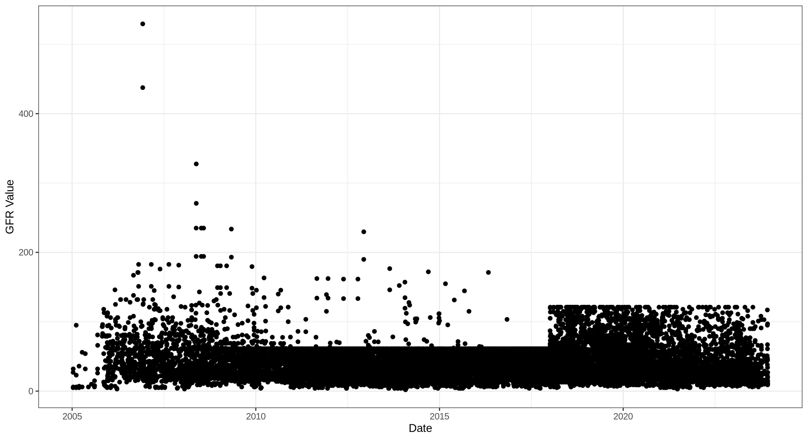
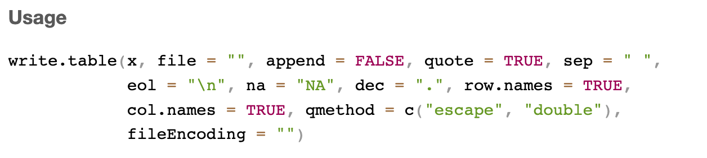

```{r setup, include=FALSE}


library(learnr)
library(gradethis)
library(tidyverse)
library(tableone)
knitr::opts_chunk$set(echo = FALSE)
options(width = 10000)
options(evaluate.new_session = FALSE)
options(tutorial.max.forked.procs=50)

#setwd('/Users/michellemcnulty/BCH Dropbox/Michelle McNulty/r_tutorial/Intro2R/')

df <- read_tsv('data/fake_data.tsv')

df_clean <- df %>% filter(!is.na(egfr) & !is.na(upcr))
## Flip treatment indicator 
df_clean$treatment <- ifelse(df_clean$treatment ==1, 0,1)
df_clean$treatment <- factor(df_clean$treatment)


df_clean$ckd <- ifelse(df_clean$egfr < 60, 1, 0)

model1 <- lm(egfr ~ snp1, data=df_clean)
model2 <- lm(egfr ~ snp1 + age + histology, data=df_clean)

model_list <- list()

for (i in 1:5) {
  snp_name <- paste0("snp", i)
  formula_str <- paste("egfr ~", snp_name, "+ age + histology")
  model <- lm(as.formula(formula_str), data = df_clean)
  model_list[[snp_name]] <- model
}


snp_res <- data.frame()
for (i in 1:5) {
  snp_name <- paste0("snp", i)
  model <- model_list[[snp_name]]
  coef_summary <- summary(model)$coefficients
  new_line <- data.frame(
    snp = snp_name,
    beta = coef_summary[snp_name, "Estimate"],
    se = coef_summary[snp_name, "Std. Error"],
    t = coef_summary[snp_name, "t value"],
    p = coef_summary[snp_name, "Pr(>|t|)"]
  )
  snp_res <- rbind(snp_res, new_line)
}


snp_name <- 'snp1'
model <- model_list[[snp_name]]
model_summary <- summary(model)
coef_summary <- model_summary$coefficients
tab <- table(df_clean$ckd, df_clean$treatment)

dimnames(tab) <- list(
  "CKD Status" = c("No CKD", "CKD"),
  "Treatment Group" = c("Placebo", "Drug")
)

```

## Introduction

### Learning goals
- Get exposure to R through data-driven learning 
- Understand how to load and clean clinical data
- Fit and interpret simple regression models in R
- Use base R and tidyverse syntax to work with data

### Why R?
- Open source (publicly available to view, modify and distribute for free)
- Easy to share code & works on different platforms
- Large supportive community 
- Many packages and functions to solve many different problems
- Rstudio - interactive interface for data analysis with R

### What this tutorial is not:
- An in depth tutorial on coding in R
- A guide to statistical methods 

But here are some great resources if you're interested in learning more:

- [swirl](https://swirlstats.com/students.html): Interactive R tutorials in Rstudio 
- [Data Science: R Basics](https://pll.harvard.edu/course/data-science-r-basics) offered by Harvard (credit: Rafael Irizarry)
- Basic data wrangling in R with dplyr: [Wrangling penguins](https://allisonhorst.shinyapps.io/dplyr-learnr/#section-welcome) (credit: Allison Horst)
- Master your data visualization with tutorials and guides at [ggplot2tor.com](https://ggplot2tor.com/) (credit: Christian Burkhart)
- Prefer a physical book? Check out [these](https://www.tidyverse.org/learn/#books) 
- Visual learner? Learn by watching on [R screencasts](https://www.rscreencasts.com/)
- Got the code down, but need a stats refresher? Check out [StatQuest](https://www.youtube.com/@statquest/playlists) on YouTube for great explanations of various statistical methods (credits: John Starmer)


## Data Analysis Outline

1. **Clarify the goal**  
   Before diving into the data, make sure you understand the **research question or hypothesis** and what is expected from the analysis.

2. **Load and check your data**  
   Confirm that the data was **imported into R correctly**. Check file paths, variable names, and dimensions to make sure nothing got lost in transfer.
   
3. **Explore and assess the data** 

   Use summaries and visualizations to get to know your dataset: 
    
    🔍 What types of variables are included? (numeric, categorical, dates, etc.)
    
    🔍 Are there any **missing values**?
    
    🔍 What do the distributions look like? Are there **outliers** or unusual values?

4. **Perform the analysis**  
   Once you're confident in the **quality and structure** of your data, begin your planned analysis (e.g., modeling, hypothesis testing).

5. **Interpret the results**  
   What do the results mean in the context of your question? Are they statistically and scientifically sound? Think critically before drawing conclusions.

6. **Communicate your findings**  
   Present your results clearly using **figures, tables, and written summaries**. Consider your audience. What do they need to understand the story your data tells?

## Clarify the goal
- A collaborator has identified genetic variants and a treatment associated with kidney function. They ask you to test these associations in your cohort. You're given a large dataset with the variants of interest, demographics information, therapeutic indicator, and kidney function for each individual in your cohort. They would like a summary of the cohort, i.e. "Table 1", p-values for tested associations, and a few figures for the paper that summarize key findings. 

## Load and check your data
Throughout this workshop, we will work with the `tidyverse` package, a suite of very useful data analysis functions. For more info visit [here](https://www.tidyverse.org/packages/). We will also work with `base R`, but we do not have to load this library, it's built in. 

```{r library, exercise=TRUE}
#install.packages("tidyverse")
library(tidyverse)
```

`library` and `package` are often used refered to interchangeably, but there is a difference. You install a `package` and then load it into your R session from its `library` location to make its contents available for use.

### Working with Directories in R

To read or write files in R, you need to know the working directory of your R session, i.e., where your R session is looking for files. R will look for files relative to this folder unless you provide an absolute path.

Use the `getwd()` function to check your current working directory:
```{r getwd, exercise=TRUE}
getwd()
```
This tells you where R is currently looking for files.

If you want R to look somewhere else (e.g., a different folder), you have to change your working directory with `setwd("path/to/your/folder")`.

>💡 Tip: If your files are stored on a network drive or external volume, your path may start with something like `/Volumes/YourDriveName`.

### Read in data

Here is what it looks like in Excel: 


There are many functions to load various types of data, `read_tsv()` from the `readr` library (from tidyverse) is one option for tab-separated files. Similarly, `read_csv()` will read in comma-separated files.

```{r read_file, exercise=TRUE}
df <- read_tsv('data/fake_data.tsv')
```

This message is from the `readr` package confirming that your tab-delimited file was read successfully and providing a summary of the column types.

This output also tells you how the function interpreted the types of data:

- These are characters/strings: `chr  (5): id, sex, histology, hispanic, race`
- These are numeric, or "double": `dbl (11): age, upcr, egfr, snp1, snp2, snp3, snp4, snp5, treatment, gene_a, gene_b`

>💡 `df` is a commonly used name for data frames because it's short and easy to type! You can name your data frames anything you'd like, but we suggest keeping names short and informative. Using `df` is fine, but if you end up with `df`, `df2`, `df3`, etc. all in your script, things can quickly become confusing.

```{r quiz1}
quiz(
  question("How many rows are there in the dataset?",
    answer("11"),
    answer("3835", correct = TRUE),
    answer("5000"),
    answer("16"),
    incorrect = "The number of rows is in the log, but you can also try using `nrow(df)` to count the rows.",
    allow_retry = TRUE
))

```

You can also use `nrow()` and `ncol()` or `dim()` to get the number of rows and columns. You can try these functions below. 

```{r get_dim, exercise=TRUE}
nrow()
```

Whoops... We might sneak in a few 'bugs' in the code for you to catch. When using a function in R, you have to define the input. Since our input is the data frame df, update the code to `nrow(df)` or `df %>% nrow()` and run again :) 

**Always make sure the dimensions match what is expected.** In this case we should have 3835 samples/rows and 16 variables/columns. Any deviation might suggest a problem importing the data. 

### Common mistakes when reading in file 

**Wrong delimiter** : Here the tsv file read with `read_csv`. 


**Column name issues** : 

- Case 1: The file has column names, but they were read in as data (row 1)


- Case 2: The file does not have column names, so the first row of data was set as column names


In both cases, the read function will have a command to specify if the file being read in has column names. For example `df <- read_tsv(file_name, col_names=TRUE)`

**Unwanted rows**:


This can be remedied by telling the read function to skip lines. For example, `df <- read_tsv(file_name, skip=3)`. Additionally, you can ignore lines that start with a given character with `df <- read_tsv(file_name, comment = "#")`

### View data
ALWAYS view the data to make sure everything imported correctly. 

`View(df)` will open a new tab in R Studio with the full data set; this will look similar to an excel spreadsheet. However, when data is large, this is not ideal and might crash your RStudio, *and this tutorial*, which would be a real bummer. Instead use the `head()` function to view the first 6 rows. Similarly, `tail()` will give you the last 6 rows.

```{r df2, exercise=TRUE}
head(df)
```

> 💡 Note that there are no spaces in the column names. You *can* have spaces, but it will make coding more difficult. It is common to use underscores or periods instead of spaces, for example 'gene_a'. 

## Column types

Before starting analyses, make sure the data are in the correct format. 

- To access a column in the data frame (df), we can use the `$`, so the treatment column would be `df$treatment`. 

- The `class()` function will confirm the data class.

```{r make_factor, exercise=TRUE}
class(df$Treatment)
```

Whoops! R is case-sensitive. "NULL" is telling you that the 'Treatment' column doesn't exist. Update to 'treatment' and run again. 

> 💡 To reduce these types of errors, it is common to stick to lower-case object names. 

We want `treatment` to be a factor (no-treatment=0 vs. treatment=1). This will allow us to treat treatment as a group when performing regression or creating figures. 

You can change the data types in R. To go from numeric to factor we can use the `factor()` function.

```{r make_factor2, exercise=TRUE}
factor(df$treatment)
```

Oooooo...this was not what we expected... We got the function correct, but we need to assign the results back to the treatment column. 
In R, `<-` is used to assign the output of a function somewhere, in this case a column in the data frame. 

```{r make_factor3, exercise=TRUE}
df$treatment <- factor(df$treatment)
class(df$treatment)
```

This time, the result of the function doesn't print to the screen, but is instead assigned the factors to `df$treatment`.

> 💡 It’s often best practice not to overwrite original columns! Make sure you're getting the values you want before writing over a column.

However, in this case it makes sense. The numeric treatment indicator isn’t meaningful on its own and won’t be used later, so we’re comfortable replacing it. This avoids cluttering the data frame with unnecessary columns while keeping the code clean.
If you ever need to revert, you can always reload the original dataset.

**So now that we know our data has imported correctly, let's check for missing data!**


## Missing data

It's important to know which data is missing and why it's missing so you can make appropriate choices for your analysis. 

Here are two example scenarios:

1. If a physician's assistant forgot to input 10 values completely at random, you might choose to impute them to avoid losing 10 samples from your study.
2. If all the missing protein values were removed due to low expression, you wouldn't want to impute them, since the missingness is informative and likely not random.

Click [here](https://www.ncbi.nlm.nih.gov/books/NBK493614/) to learn more about types of missing data. 

To count the missing values in each column, we will first use `is.na()` to turn each cell in the data frame into a TRUE if missing or FALSE if present.

- The tidyverse uses the `%>%` operator to "pipe" data through a sequence of functions.
- In the example below, we’ll use `%>%` to pipe the data frame into the `is.na()` function.

```{r isna, exercise=TRUE}
df %>% is.na() %>% head()

# could also do head(is.na(df))
```

We will then use `colSums()` to count the number of missing values in each column. (NOTE: `rowSums()` will sum across rows. This would be useful if we wanted to know how much missing each sample had).

```{r missing1, exercise=TRUE}
missing_count <- df %>% is.na()
colSums(missing_count)
```

**Challenge:** This can be written as series of function using `dplyr` from `tidyverse`. Give it a try! And click 'Hint' if needed. 

```{r missing, exercise=TRUE}

```

```{r missing-hint-1}
input %>% process1 %>% process2
```

```{r missing-hint-2}
The solution will not have 'missing_count' in it.
```

```{r missing-solution}
df %>% is.na() %>% colSums()

OR 

colSums(is.na(df))
```

```{r quiz2}
quiz(
  question("Which columns have missing data",
    answer("age"),
    answer("sex"),
    answer("upcr", correct = TRUE),
    answer("egfr", correct = TRUE),
    allow_retry = TRUE
  ))
```

There are many ways to handle missing data, for example imputation. In this tutorial, we are simply going to remove rows with missing values. 

___
**But first....** We need to learn the `filter()` function from the `dplyr` package (loaded automatically with tidyverse).

- This function is analogous to filtering columns in an excel sheet to create a new subset of the data.
- The `filter()` function keeps only the rows that meet the condition(s) you specify. 

Here are some basic logical operators you can use inside `filter()`:

- `==`  equal to
- `>` / `<`  greater than / less than
- `>=` / `<=` greater than or equal to / less than or equal to
- `!=`  not equal to
- `&`  AND (both conditions must be TRUE)
- `|`  OR (at least one condition must be TRUE)
- `is.na` is missing 
- `!is.na` is not missing 

Here are a few examples 

NOTE: `head(n=2)` allows us to just view the top of the filtered data, if we didn't include this, the full filtered data frame can overwhelm our screens. Try it out if you're feeling adventurous...

```{r filter_missing, exercise=TRUE}
## Keep only male 
df %>% filter(sex == 'Male') %>% head(n=2)

## Keep age 50 and up 
df %>% filter(age >= 50) %>% head(n=2)

## Keep men age 50 and up 
df %>% filter(sex == 'Male' & age >= 50) %>% head(n=2)

## Remove individuals with MN 
df %>% filter(histology != 'MN') %>% head(n=2)

## Keep samples with missing eGFR
df %>% filter(is.na(egfr)) %>% head(n=2)

```

Above we just viewed the head of each subset data frame. Here we assign the filtered dataframe to a new dataframe. 

```{r filter_missing2, exercise=TRUE}

## Keep men >= 50 and create a new data frame 
df_50_men <- df %>% filter(sex == 'Male',  age >= 50) 
```

**Now you try!**
Create a new data frame called `df_clean` that removes samples (rows) with missing *egfr* or *upcr* Use hints when needed! 

```{r filter_missing3, exercise=TRUE} 
____ <- df %>% filter(____, ____)

## Count number of rows in df_clean
nrow(df_clean)
``` 

```{r filter_missing3-hint-1}
`!` = inverse, so if `is.na()` is missing, `!is.na()` would be not missing.
```

```{r filter_missing3-hint-2}
 filter(!is.na(column1), !is.na(column2))
```

```{r filter_missing3-hint-3}
df_clean <- df %>% filter(!is.na(egfr) , !is.na(upcr))
```

```{r filter_missing3-check}
grade_result(
  pass_if(function(result) {
    is.numeric(result) && result == 3331
  }, "Great work!"),
  
  fail_if(function(result) TRUE, "Incorrect. Check your filtering logic.")
)
```

> 💡 As we mentioned, there are many ways to get the job done. `df %>% drop_na(egfr , upcr)` or `df_clean <- na.omit(df)` would also work, but the `filter()` function allows for more flexibility.

Check our [this tutorial](https://learnr-examples.shinyapps.io/ex-data-filter/#section-welcome) for more practice on filtering! 

## Distributions of each column 

### Categorical columns
Use the `table()` function to get counts how many individuals are in each group and `prop.table()` to get percentages.  

#### Sex

```{r sex, exercise=TRUE}
table(df_clean$sex) # gives raw counts
prop.table(table(df_clean$sex)) # gives proportions 
```

#### Histology

```{r histology, exercise=TRUE}
table(df_clean$histology)
prop.table(table(df_clean$histology))
```

#### Race/Ethnicity 

```{r race,exercise=TRUE}
table(df_clean$race)
prop.table(table(df_clean$race))
```

```{r race2, exercise=TRUE}
table(df_clean$hispanic)

## Type code below to get the proportion of Hispanic individuals 
_____(_____(_____))
```

```{r quiz3}
quiz(
  question("What proportion of individuals are Hispanic or Latino?",
    answer("13595"),
    answer("0.21",correct = TRUE),
    answer("0.78"),
    answer("0.02"),
    allow_retry = TRUE
  ))
```

### Continuous columns
Measures of central tendency (mean, median), max & min, and standard deviation can all be calculated with the following functions:

#### Age

```{r age, exercise=TRUE}
mean(df_clean$age)
median(df_clean$age)
min(df_clean$age)
max(df_clean$age)
sd(df_clean$age)
```

There is no base R function for mode, you have to write a short function or use another R package. But, very rarely will you need the mode of your data. 
Alternatively, you can use the `summary()` function to get all of these values. If you need standard deviation, it's not included in summary.

```{r age2, exercise=TRUE}
summary(df_clean$age)
sd(df_clean$age)
```

#### UPCR

```{r upcr, exercise=TRUE}
summary(df_clean$upcr)
sd(df_clean$upcr)
```

#### eGFR
Type code to get a summary of egfr values and standard deviation

```{r egfr, exercise=TRUE}


```

```{r egfr-hint-1}
summary(_____)
sd(_____)
```

```{r egfr-solution}
summary(df_clean$egfr)
sd(df_clean$egfr)
```

```{r quiz4}
quiz(
  question("What is the mean and standard deviation for eGFR?",
    answer("6.03, 237.38"),
    answer(" 77.42, 35.49"),
    answer("77.71, 35.49",correct = TRUE),
    answer("77.71, 6.03"),
    allow_retry = TRUE
  ))
```


##  Visualizing Data
There are basic visualization tools in R, like the `plot()` function, and many plotting packages. We find `ggplot` to be the best option for customizing figures. 

The syntax for ggplot is a little different than what we've seen so far. You can customize the figure by adding on new 'layers'. 

**Here is a nice painting analogy of the ggplot layers thanks to chatGPT:**

- Base layer `ggplot(data, aes(...))`
  - This is your blank canvas and palette setup — you’ve chosen the materials and how colors (data) should be organized, but nothing's on the canvas yet.

- `+ geom_*()` layers
  - These are your brushstrokes — the actual painting begins here, each geom layer adds a visual element like dots, lines, or bars.

- `+ labs() + theme()`
  - These are your title, labels, and frame — they don’t change the painting itself but shape how it’s presented.

- `+ facet_*()`
  -  Imagine hanging a series of related paintings in a gallery — each one highlights a different subset of your data.

```{r ggplot, exercise=TRUE}
ggplot(df_clean, aes(x=age, y=egfr))
```

This plot is missing something..... the data! Remember this first layer will only make the "canvas". ggplot needs to know what type of plot we want to apply to the data. 

We have to add on what type of plot we want to use. Some common plots are: 

- scatter plot: *geom_point()*
- histogram: *geom_hist()*
- box plot: *geom_boxplot()*
- bar plot: *geom_barplot()*
- [many more](https://r-graph-gallery.com/ggplot2-package.html)

___ 

### Scatter Plots 
Since this example is 2 continuous values, we will add a *geom_point()* layer.

```{r ggplot_scatter1, exercise=TRUE}
ggplot(df_clean, aes(x=age, y=egfr)) + 
  geom_point()
```

Once you get the baseline plot, you can start customizing. 
To make changes to the points, add to the `geom_point()` function. 
Change the code below to see how different sizes, colors (outline), fill (inside), and shapes. 

```{r ggplot_scatter2, exercise=TRUE}
ggplot(df_clean, aes(x=age, y=egfr)) + 
  geom_point(size=5, fill='blue', color='red', shape=24) 
```


 
*NOTE: Only shapes 21-25 have a fill option*

If you want to customize the points based on another variable in the data frame, you have to wrap the customization in `aes()`.
This part is a little confusing, so bear with us...

- If the aestetic is in the `ggplot(aes(_____))` line, the aestetic will apply to every layer of the plot. 
- If the aestetic is in the `geom_*()` function, it will only be applied to that layer. 
- With just one layer, it doesn't matter, but future you might want to get fancier with your figures, so it's good to know.

```{r ggplot_scatter3, exercise=TRUE}
ggplot(df_clean, aes(x=age, y=egfr, size=upcr, color=histology, shape=sex)) + 
  geom_point() 

## Note that this code will make the same plot since there is only one layer (geom_point)
# ggplot(df_clean, aes(x=age, y=egfr)) + 
#   geom_point(aes(size=upcr, color=histology, shape=sex)) 

```

Obviously, this figure is hideous and reviewer #2 is likely going to make you change it. But it's a good start in understanding how to use `aes()` to customize figures. 

Make a scatter plot of gene_a vs. upcr, with point size = 2, and color = histology

```{r ggplot_scatter4, exercise=TRUE, eval=TRUE}

```

```{r ggplot_scatter4-hint-1}
ggplot(df_clean, aes(x=_____, y=_____, color=______)) + 
  geom_point(size=___) 
```

```{r ggplot_scatter4-solution}
ggplot(df_clean, aes(x=gene_a, y=upcr,color=histology)) + 
  geom_point(size=2) 
```

Nice work! Now see how the above figure changes when you add the line `+ facet_grid(~histology)`. Facet's are great ways to stratify by groups of interest!

___ 

### Histogram
Histograms are great for seeing the distribution of continuous variables

```{r ggplot_histogram1, exercise=TRUE}
ggplot(df_clean, aes(x=upcr)) + 
  geom_histogram()
```

You can see here, that UPCR is skewed. Since many analyses assume variables follow a normal distribution, UPCR is often log2 transformed. We add a small number to upcr to avoid taking the log of 0. 

Also... we got a warning. The plot is using `bins=30` as the default, but we can change it to best match the data. Adding `bins=<integer>` will change the number of bars.

  - REMINDER: Since the `bins=___` does not include any data from `df_clean`, it does not need to be wrapped in `aes()`
  - Note that the log2 transform can be applied in the plotting function! Another method would be to make a new column `df_clean$log2upcr <- log2(df_clean$upcr+0.1)`, then plot the new column. 

```{r ggplot_histogram2, exercise=TRUE}
ggplot(df_clean, aes(x=log2(upcr+0.1))) + 
  geom_histogram(bins=40)
```

Oh boy, I'm sure glad we visualized this. We need to think very carefully about how we model UPCR! 

Next, if we want to see how UPCR varies across groups, we can stratify the distribution by any categorical variable using `fill=____`. 

The options for `position=` are 'identity', 'dodge' and 'stack'. Try them all to see how they look! You can also adjust `alpha=<0 to 1>` to change the transparency of the bars.

```{r ggplot_histogram3, exercise=TRUE}
ggplot(df_clean, aes(x=log2(upcr), fill=sex)) + 
  geom_histogram(position='identity', alpha=0.5, bins=20)
```

ggplot comes with different available themes. Try adding these themes to the egfr histogram to see how it changes:

- theme_classic()
- theme_bw()
- theme_light()
- theme_dark()
- theme_minimal()
- theme_void()

```{r ggplot_histogram4, exercise=TRUE}
ggplot(df_clean, aes(x=egfr, fill=sex)) + 
  geom_histogram(position='dodge', bins=50) +
  theme_classic()
```

Make a histogram plot of age stratified by histology with overlapping histograms

```{r ggplot_histogram5, exercise=TRUE, eval=TRUE}

```

```{r ggplot_histogram5-hint-1}
ggplot(df_clean, aes(x=_____, fill=_____)) + 
  geom_histogram() 
```

```{r ggplot_histogram5-solution}
ggplot(df_clean, aes(x=age, fill=histology)) +
  geom_histogram() 
```

Note that there's a weird shared pattern across histologies, which is likely an artifact of the simulated data. You can still learn a lot by investigating these anomalies though! 

___ 

Making figures in R is an iterative process. Start simple and build up! You will have so many more ugly plots that useful ones, but this is just a part of the process!
Here are some examples where the ugly figures informed us about the data. 

- Here we tried to make a manhattan plot for GWAS results and realized the results file was not filtered to the covariate of interest. 


- Can anyone guess what happened here?



## Simple statistical tests 

### t-test (normally distributed continuous variable & 2-groups)

The `t.test(value ~ group)` function is used to compare means between two groups.

>💡  This is the first time we're seeing the `y~x` syntax. This is modeling the output, y, as a function of the input, x. Remember you can always check the documentation for the function to see the syntax by running `?funtion_name`. 

Let's compare eGFR between male and female with a two-sided t-test.

Note: `two-sided` is the default alternative hypothesis, which means it doesn't have to be included in the function. You can also do `alternative = 'less'` or `alternative = 'greater'` to perform one-sided tests. 

```{r ttest-example, exercise=TRUE}
# Run a t-test to compare the means of the two groups
t.test(egfr ~ sex, data = df_clean, alternative = "two.sided")
```

The results show the t-statistic and p-value. You can also see the mean in each group. In this case, there is no statistically significant difference in eGFR between males and females. 

It's always good practice to confirm associations statistically and visually. Also, this is good practice for all the ggplot skills you just learned! 

```{r ttest-plot, exercise=TRUE}
ggplot(df_clean, aes(x = sex, y = egfr)) + 
  geom_boxplot() + 
  theme_minimal()
```

Now you try! Do a t-test to test if there is a difference in the mean age comparing those with or without the treatment. 

```{r ttest-quiz, exercise=TRUE}

______

```

```{r ttest-quiz-hint-1}
t.test(____ ~ _____, data = ______)
```

```{r ttest-quiz-hint-2}
t.test(age ~ treatment, data = df_clean, alternative = "two.sided")
```

The p-value is very small, so the results reports it as `p < 2.2e16`. If we want the exact p-value, we can assign the test results to an object and extract the p-value. 

To see the items stored in the new object, use the `str()` function. 

```{r ttest-pval, exercise=TRUE}
test <- t.test(age ~ treatment, data = df_clean)
str(test)
test$p.value
```

Whoa, that's very significant! Ideally treatment would be randomly distributed across ages, so keep this in mind for association testing, it could be a problem! 

Now create a plot to confirm visually. 

```{r ttest-plot-quiz, exercise=TRUE}
# Plot code here 
________
```


```{r ttest-plot-quiz-hint-1}
ggplot(____, aes(x = ___, y = ____)) + 
  geom_boxplot() + 
  theme_minimal()
```

```{r ttest-plot-quiz-hint-2}
ggplot(df_clean, aes(x = treatment, y = age)) + 
  geom_boxplot() + 
  theme_minimal()
```


```{r quiz100, quiz=TRUE}
quiz(
  question("Which statement(s) are true:",
           answer("Age is significantly different between treatment status (p = 1.14e-227)", correct = TRUE),
           answer("The mean age for those without the treatment is 51.9", correct = TRUE),
           answer("The mean age for those on treatment is 29.01", correct = TRUE),
           answer("There appears to be an age bias in this study where younger participants are more likely to be on the treatment", correct = TRUE),
           allow_retry = TRUE
  ))
```

---

### Wilcoxon Rank-Sum Test  (non-normally distributed continuous variable & 2-groups)

Use the Wilcoxon rank-sum test when data is not normally distributed. The syntax is similar to the t.test function: `wilcox.test(value ~ group)`.

We know UPCR is not normally distributed, so let's use a Wilcoxon rank-sum test to test if there is a difference between UPCR and sex. 

```{r wilcox-code, exercise=TRUE}
# Run a Wilcoxon rank-sum test
wilcox.test(upcr ~ sex, data = df_clean, alternative = "two.sided")
```

There is no statistically significant difference in UPCR between male and female (p=0.18). 

Let's plot to confirm!

```{r wilcox-plot, exercise=TRUE}
ggplot(df_clean, aes(x = sex, y = upcr)) + 
  geom_boxplot() + 
  theme_minimal()
```

___ 

Now you try! Perform a ***one-sided*** Wilcoxon rank sum test to ***test if individuals on the treatment have lower UPCR*** compared to those without treatment.

> 💡  When using a formula like `y ~ group` and setting `alternative = "less" or "greater"`, R tests whether the first group (based on factor level order) has a lower or higher median than the second.

Use levels() to check which group is listed first. 

```{r wilcox-levels, exercise=TRUE}
levels(df_clean$treatment)
```
Since `"0"` (no treatment) is the first group:

Using `alternative = "greater"` tests if untreated individuals have higher UPCR.

- H₀: median(UPCR in "0") ≤  median(UPCR in "1")

- H₁: median(UPCR in "0") > median(UPCR in "1")

  - i.e., UPCR is higher in the untreated group → treated group has lower UPCR

NOTE: You can also change the levels of the factor so treatment is the first group using `levels(df_clean$treatment) <- c("1", "0")` 

Write your Wilxox rank sum test below. 
```{r wilcox-quiz, exercise=TRUE}
__________
```

```{r wilcox-quiz-hint-1}
wilcox.test(____ ~ _____, data = ______, alternative = ______)
```

```{r wilcox-quiz-hint-2}
Remember, the options for the alternative hypothesis are c("two.sided", "less", "greater")
Testing if UPCR is lower is the treated group is the same as testing if UPCR is higher in the non-treated group (our reference group). 
```

```{r wilcox-quiz-hint-3}
wilcox.test(upcr ~ treatment, data = df_clean, alternative = "greater")
```

It can be confusing to know which group has higher or lower values and the wilcox.test function does not report group medians like t.test reports group means. 

Here is a simple way to calculate the median in each group using tidyverse to string together functions. 

```{r wilcox-tidy, exercise=TRUE}
df_clean %>%  #start with the df_clean data frame
  group_by(treatment) %>%  #then group the rows by `treatment`
  summarize(median_upcr= median(upcr)) #then summarize the data by calculating median(upcr) and assigning the value to a column named 'median_upcr'

```

> 💡 The `group_by()` and `summarize()` functions from the `dplyr` package (included in tidyverse) is super helpful and used often! 

Now create a plot to confirm visually. 

```{r wilcox-plot-quiz, exercise=TRUE}
# Plot code here 
________
```


```{r wilcox-plot-quiz-hint-1}
ggplot(____, aes(x = ___, y = ____)) + 
  geom_boxplot() + 
  theme_minimal()
```

```{r wilcox-plot-quiz-hint-2}
ggplot(df_clean, aes(x = treatment, y = upcr)) + 
  geom_boxplot() + 
  theme_minimal()
```


```{r quiz1010, quiz=TRUE}
quiz(
  question("Which statement(s) are true:",
           answer("Individuals on the treatment have lower UPCR (p=0.008)"),
           answer("There is no evidence that individuals on the treatment have lower UPCR (p=0.99)", correct = TRUE),
           answer("There is no difference between median UPCR when comparing treatment groups"),
           answer("We did not test if individuals on the treatment have higher UPCR", correct = TRUE),
           allow_retry = TRUE
  )
)

```


Did the one-sided test feel overly complicated? We included it to highlight a few key lessons:

  1. Know your reference group. Misunderstanding which group is the baseline will flip the interpretation of your result.
  2. Use multiple lines of evidence. A single p-value is rarely enough to draw strong conclusions.
  3. One-sided tests limit discovery. By committing to a single direction, you may miss interesting or unexpected effects. Try changing the test to "less" or "two.sided" to explore what you might be missing.

One-sided tests do offer more power, but beware! You should only use them if you have a very strong prior justification for ignoring effects in the opposite direction.

Want to dig deeper into this topic? Check out this blog post from [Statsig](https://www.statsig.com/blog/one-tailed-vs-two-tailed-tests) on one-tailed vs. two-tailed tests.

---

### ANOVA & Kruskal-Wallis Tests (continuous outcomes & >2 groups)
When you're comparing a continuous variable across three or more groups, you need to decide between using a parametric (ANOVA) or non-parametric ( Kruskal-Wallis) test depending on whether your data meet certain assumptions.

ANOVA (Analysis of Variance) tests whether the mean of a continuous variable differs between groups. 
It assumes:

- The outcome is approximately normally distributed within each group
- The variances are roughly equal across groups (homoscedasticity)
- Observations are independent


We know eGFR is normally distributed. Use the `aov()` function to run an ANOVA to test if average eGFR differs by histology group.
```{r anova1, exercise=TRUE}
aov(egfr ~ histology, data = df_clean)
```

Where's the p-value!? To get more information from the test, including p-value, use `summary()`
```{r anova1_sum, exercise=TRUE}
summary(aov(egfr ~ histology, data = df_clean))
```

You can also visualize the distributions:
```{r anova2, exercise=TRUE}
ggplot(df_clean, aes(x = histology, y = egfr)) +
  geom_boxplot() +
  theme_minimal()

```

___ 

If your outcome is not normally distributed or has strong outliers, use the **Kruskal-Wallis test**. This non-parametric test compares the ranked values rather than raw values and is more robust to skewed distributions and unequal variances.

Use the `kruskal.text()` function to test if UPCR differs by histology group.
```{r kruskal, exercise=TRUE}
kruskal.test(upcr ~ histology, data = df_clean)
```


### Correlation Analysis (2 continuous variables)

Let's look at the correlation between eGFR and age. The options for correlation used are `c("pearson", "kendall", "spearman")`. The default method is set to calculate Pearson correlations, which works well for linear trends. 

First, let's plot eGFR and age to see if the trend is linear. This time, let's add `geom_smooth()` to our plot which will add a line showing the trend. 

```{r cor_plot, exercise = TRUE}
ggplot(df_clean, aes(age, egfr)) + 
    geom_point() + 
    theme_minimal() + 
    geom_smooth()
```

Since this is a linear trend, we can use a Pearson correlation. This is the default option for `cor()`, but we can also add it to our model to make the code more explicit. Also, this makes it easier to remember what you did when you write your methods section! 

```{r cor-code, exercise=TRUE}
cor(df_clean$egfr, df_clean$age, method='pearson')
```

The `cor()` function only returns the correlation, r. If we want to test the significance of the correlation, we want to use `cor.test()`

```{r cor-code2, exercise=TRUE}
cor.test(df_clean$egfr, df_clean$age, method='pearson')
```

The output returns the same correlations, `r=-0.37`, but this time with a p-value and confidence interval. 

___ 

Now let's try on your own for UPCR and age.  

```{r cor_plotb, exercise = TRUE}
#Type ggplot code below to make a scatter plot comparing UPCR and age. 


```

```{r cor_plotb-hint-1}
ggplot(____________) + 
    geom_point() 
```

```{r cor_plotb-hint-2}
ggplot(df_clean, aes(age, upcr)) + 
    geom_point() + 
    theme_minimal() + 
    geom_smooth()
```

Based on this figure, would you calculate a linear or non-linear correlation?

Calculate correlation below: 
```{r cor-codeb, exercise=TRUE}

```

```{r cor-codeb-hint-1}
cor(___, ___, method='spearman') # Use spearman correlation since the trend is non-linear 
```

```{r cor-codeb-hint-2}
cor(df_clean$upcr, df_clean$age, method='spearman')
```

Use `cor.test()` to test the significance of the correlation. 

```{r cor-code2b, exercise=TRUE}

```

```{r cor-code2b-hint-1}
same as above but with `cor.test()`
```


---
### 

```{r quizbb, quiz=TRUE}
quiz(
  question("What does the formula syntax `egfr ~ histology` mean in R?",
    answer("Model histology as a function of egfr"),
    answer("Model egfr as a function of histology", correct = TRUE),
    answer("It performs correlation between egfr and histology"),
    answer("It groups egfr by histology for plotting"),
    allow_retry = TRUE
  ),
  
  question("You run `test <- t.test(age ~ treatment, data = df_clean)`. What line of code will show the structure of the data stored in `test`?",
    answer("structure(test)"),
    answer("class(test)"),
    answer("summary(test)"),
    answer("str(test)", correct = TRUE),
    allow_retry = TRUE
  ),

  question("What does this code return?\n\n`df_clean %>% group_by(sex) %>% summarize(mean_age = mean(age))`",
    answer("A new column added to df_clean called mean_age"),
    answer("A summary table showing the mean age for each sex group", correct = TRUE),
    answer("A scatter plot of age by sex"),
    answer("An error because you didn't include mutate()"),
    allow_retry = TRUE
  ))

```


## Perform the analysis #1

Let's test if the genetic variants (SNP1-5) are associatied with kidney function. Since eGFR is continuous and approximately normally distributed, we can use linear regression with the `lm(Y ~ X, data=<dataframe>)` function.

Below is a model that tests the effect of the SNP (independent variable) on eGFR (dependent variable). This is the unadjusted model since we have not included covariates, for example age or sex. We want to test an additive model, i.e., each SNP is associated with the same change in eGFR. The SNPs are coded as numeric, which is perfect. 

```{r lm1, exercise=TRUE}
model1 <- lm(egfr ~ snp1, data=df_clean)
summary(model1)
```

#### Interpreting the Model Summary

**Call**: The regression model used.

**Residuals**: Summary of the distribution of residuals. Symmetric residuals centered around 0 suggest a good model fit.

**Coefficients**:

  - *Estimate*: The estimated effect size (beta) for the intercept and each independent variable.  
  - *Std. Error*: The standard error of the estimate.  
  - *t value*: Estimate divided by Std. Error; used to test whether the coefficient is significantly different from 0.  
  - *Pr(>|t|)*: The p-value; the probability of observing a t-value as extreme or more extreme than the one calculated if the predictor had no effect (null hypothesis).

#### Model Diagnostics

**Residual Standard Error (RSE)**: The estimated standard deviation of the residuals — how far, on average, your model’s predictions are from the actual observed values, in the same units as the outcome variable.

**Multiple R-squared**: The proportion of variance in the outcome (dependent variable) that is explained by the model.

**Adjusted R-squared**: R-squared adjusted for the number of independent variables in the model. Use this when comparing models with different numbers of predictors.

**F-statistic**: A global test of model significance.
  - Null hypothesis (H₀): All regression coefficients (except the intercept) are equal to 0.

**p-value (for F-statistic)**: The probability of observing an F-statistic as large as the one calculated if the null hypothesis were true.


```{r quiz5}
quiz(
  question("What does a negative coefficient for SNP1 in the linear model suggest?",
    answer("Individuals with the effect allele have lower eGFR on average.", correct = TRUE),
    answer("The model failed to converge."),
    answer("SNP1 is not associated with eGFR."),
    answer("The SNP1 allele increases eGFR."),
    allow_retry = TRUE
  )
)

```

___

### Adjust for covariates
This model includes age and histology as a covariates, both are known to be associated with eGFR. 

To add covariates, use the `+` sign: `lm(Y ~ X1 + X2 + X3 + ... + XN, data=<dataframe>)` 

```{r lm2, exercise=TRUE}
model2 <- lm(egfr ~ snp1 + age + histology, data=df_clean)
summary(model2)

```

You can use the model diagnostics to see if adding the covariates resulted in a better fit. 

  - The adjusted R-squared for the adjusted model (R^2^~adj~=0.23), is greater than the adjusted R-squared from the simpler model with only snp1 (R^2^~adj~=0.01), indicating `age` and `histology` improve our model. 
 
  - Note that the results for the categorical histology covariate look different than the continuous age covariate.* 
  - FSGS is not included in the output becuase it is the reference group. 
  - You can change the reference group if needed using the `levels()` function.

```{r quiz6}
quiz(
  question("Which of the following is the correct R syntax to fit a linear model that includes SNP3, sex, and histology as predictors of UPCR?",
    answer("lm(upcr ~ snp3 + sex + histology, data = df_clean)"),
    answer("lm(df_clean, upcr ~ snp3 + age + histology)"),
    answer("lm(upcr ~ snp3 + sex + histology)"),
    answer("lm(upcr ~ snp3, sex, histology, data = df_clean)", correct = TRUE),
    allow_retry = TRUE
  )
) 


```
___ 

You can also visually assess the models with with diagnostic plots. See [HERE](https://library.virginia.edu/data/articles/diagnostic-plots) for more details on each diagnostic plot.

```{r lm3, exercise=TRUE }
plot(model2)
```

For more details on linear models and diagnostics in R, check out this [lesson on Data Camp](https://www.datacamp.com/tutorial/linear-regression-R) and this [cheat sheet from Code Academy](https://www.codecademy.com/learn/learn-linear-regression-in-r/modules/linear-regression-in-r/cheatsheet) 

### Running multiple tests
We want to test association with each SNP, but copying the regression code could get tedious, especially if there are more than 5. To make this efficient, we must first review loops and lists.

### For Loops 

There are a few types of loops, but for this analysis, we will use a `for loop`. Check out [this tutorial](https://intro2r.com/loops.html) to learn more about loops!

- A `for loop` runs the same code once for each value in a sequence.
- This loop runs 5 times where `i` takes a value from 1 to 5. (`1:5` in R will create the sequence `1,2,3,4,5`)
- The code inside the {} is executed for each value of i.
- You need to use the `print()` function to print each output to your screen 

Play with the code below to see what else you can do with `i`! Loop through the hints for different examples. 

```{r loop, exercise=TRUE}
for (i in 1:5) {
  print(i)
}
```

```{r loop-hint-1}
for (i in 1:5) {
  print(i + 5)
}
```

```{r loop-hint-2}
for (i in 1:5) {
  x <- i*20
  print(x)
}
```

```{r loop-hint-3}
for (i in 1:5) {
  snp_name <- paste0("snp", i)
  print(snp_name)
}
```

```{r loop-hint-4}
for (i in 1:5) {
  dataframe_id <- df_clean[i, 'id']
  print(dataframe_id)
}
```

### Lists

- A list can store a collection of elements of different types and sizes
- Use `[[<list_item>]]` to access list element

```{r lists, exercise=TRUE}
my_list <- list(
  name = "Joseph",
  age = 9,
  egfr = c(90, 85, 92),
  info = data.frame(height = 165, weight = 60)
)

## You can also add new items to the list
my_list[["histology"]] <- "FSGS"

print(my_list)
```

### Putting it together: Saving linear regression results in a list using a loop
- Since we want to run the loop for snp1 to snp5, we will use `i` as a place holder for 1 to 5, since this is the only part of our model that changes.
- Since the SNP id is snp*i* and not just *i*, we can use the `paste()` function to put the two strings together. 
  - The default is to add a space between each string. We can update this with `sep=''`, which tells the paste function to paste the strings with no space in between. 

> 💡 Before running the loop, it's helpful to troubleshoot the code on one element and print intermediate values to make sure the code is doing what you want it to do. It usually takes a few tries to get what you want! 

```{r lm_list, exercise=TRUE}

i <- 1
snp_name <- paste("snp", i, sep='')
print(snp_name)

formula_str <- paste("egfr ~", snp_name, "+ age + histology")
print(formula_str)

model <- lm(as.formula(formula_str), data = df_clean)
print(model)

```

It looks good :) Now we can run for all SNPs!

- You can create an empty list with `list()` 
- The results from each of the regression models can be added as list items!

```{r lm_list1, exercise=TRUE}

model_list <- list() #Create empty list to store snp_res for each SNP

for (i in 1:5) {
  snp_name <- paste0("snp", i)
  formula_str <- paste("egfr ~", snp_name, "+ age + histology")
  model <- lm(as.formula(formula_str), data = df_clean)
  model_list[[snp_name]] <- model
}

print(model_list)
```

You can view the summary for each SNP by using the list index

```{r lm_list2, exercise=TRUE}

summary(model_list[['snp1']])

```

Modify the code above to answer this question: 

```{r quiz7}
quiz(
  question("What is the estimated effect size and p-value for SNP3?",
    answer("-2.20, < 2.2e-16"),
    answer("-4.80, 5.85e-09"),
    answer("-2.20, 0.01", correct = TRUE),
    answer("-0.64, <2e-16"),
    allow_retry = TRUE
  ))
```

___ 

If we had more than 5 models, going through each on their own would be tedious. We can create another loop to go through and get the summary stats we're interested in. 

Again, it's easier to start with the first in the loop and add the loop once you know the code is doing what you want it to do. 

```{r lm_list4, exercise=TRUE}

i <- 1
snp_name <- paste("snp", i, sep='') ## Make SNP ID 
print(snp_name)

model <- model_list[[snp_name]] # Retrieve the model for the selected SNP
model_summary <- summary(model) # Use the summary() function to get the model summary, which contains the effect size and pvalue we're interested in
print(model_summary)
```

Now we see the model summary, we need to extract pieces we're interested in.

One way to see the structure of an object is with `str()` function.

```{r lm_list5, exercise=TRUE}
str(model_summary)
```

You can see here that `model_summary` is a list with 11 items.

Since we're interested in the `coefficients` section, we can extract just this item using `$`, just like we did to get columns in our data frame! 

```{r lm_list6, exercise=TRUE}
coef_summary <- model_summary$coefficients # or model_summary[['coefficients']]
print(coef_summary)
```

Now we're only interested in the row with the SNP ID. Remember we can index a matrix with `[row,column]`, since we want the row with the SNP id and all columns, we can do this: 

```{r lm_list7, exercise=TRUE}
coef_summary[snp_name,]
```

> 💡 Leaving the index blank (like the column index above) will return all the rows or columns (in this case columns). 

If we want a specific column, we can indicate it in the column index. 

```{r lm_list8, exercise=TRUE}
coef_summary[snp_name,"Estimate" ]
```

We can do the same to get the standard error, t-value and p-value. 

**Let's put it all together!**

This code looks intimidating, but let's break it down line-by-line:

  - `snp_res <- data.frame()` create an empty data frame called 'snp_res'. This will give us an object to add new lines to 
  
  - `for (i in 1:5) {` loop through numbers 1 to 5
  
  - `snp_name <- paste0("snp", i)` create the SNP name, as we did above
  
  - `model <- model_list[[snp_name]]` get the model for the SNP
  
  - `model_summary <- summary(model)` generate the model summary
  
  - `coef_summary <- model_summary$coefficients` get the coefficients from the model 
  
  - `new_line <- data.frame(` Create a data frame called 'new_line' with the model information we're interested in
  
  - `snp = snp_name` Create a column called 'snp' and assign the 'snp_name'
  
  - ` beta = coef_summary[snp_name, "Estimate"]` Get the beta for the SNP, same for `se`, `t`, and `p`
  
  - `snp_res <- rbind(snp_res, new_line)` Add the new line to the snp_res data frame using the row binding function `rbind()`
  
```{r lm_list9, exercise=TRUE}
snp_res <- data.frame()

for (i in 1:5) {
  snp_name <- paste0("snp", i)
  model <- model_list[[snp_name]]
  model_summary <- summary(model)
  coef_summary <- model_summary$coefficients
  new_line <- data.frame(
    snp = snp_name,
    beta = coef_summary[snp_name, "Estimate"],
    se = coef_summary[snp_name, "Std. Error"],
    t = coef_summary[snp_name, "t value"],
    p = coef_summary[snp_name, "Pr(>|t|)"]
  )
  snp_res <- rbind(snp_res, new_line)
}

print(snp_res)

```

### Multiple testing correction

Multiple testing correction is a statistical procedure that adjusts for the increased risk of false positives when performing multiple hypothesis tests. 

Check out [this lesson](https://stats.libretexts.org/Bookshelves/Applied_Statistics/Biological_Statistics_(McDonald)/06%3A_Multiple_Tests/6.01%3A_Multiple_Comparisons) to learn more about multiple testing.*  

You can use the `p.adjust()` function to generate adjusted p-values. Here we use it using the Benjamini & Hochberg false discovery rate (FDR) method. 

```{r adjust0, exercise=TRUE}
p.adjust(snp_res$p, method='fdr') ## 'bh' will also work :) 
```

Now use what you've learned to assign these adjusted p-values to a new column in `snp_res` called `adj_p` in the `snp_res` data frame. 
```{r adjust, exercise= TRUE}
___PUT YOUR CODE HERE_________ 

print(snp_res)
```

```{r adjust-hint-1}
____$____ <- p.adjust(______) 
```

```{r adjust-hint-2}
____$____ <- p.adjust(snp_res$p, method='fdr') 
```

```{r adjust-hint-3}
snp_res$adj_p <- p.adjust(snp_res$p, method='fdr') 
```

View the updated snp_res table to answer the question below

```{r quiz8}
quiz(
  question("Which statement(s) are accurate? (significance = p<0.05)",
    answer("SNP1 and SNP3 are significant before multiple testing correction.", correct = TRUE),
    answer("There are three SNPs significant before multiple testing correction."),
    answer("After multiple testing correction, only SNP1 is significant"),
    answer("After multiple testing correction, SNP1 and SNP3 is significant", correct = TRUE),
    allow_retry = TRUE
  ))
```

### Save snp_res 

There are many different functions for saving data of various formats. 

`write.table()` is a flexible function that allows you to save the data in multiple formats. 



```{r write, exercise=TRUE}

write.table(snp_res, "egfr_snp_results.tsv", sep='\t', row.names=FALSE)

```


## Perform the analysis #2

Let's see if the treatment is associated with CKD. 

First we need to make a new column to define CKD as eGFR < 60. 

We can do this with an `ifelse()` statement. 

- The syntax is: `ifelse(statement, true_response, false_response)` — if statement is TRUE, it returns true_response; if FALSE, it returns false_response.

Here is an example:

```{r ifelse, exercise=TRUE}

ifelse(5>2, 'this inequality is TRUE', 'this inequality is FALSE')

```

Now lets make a binary indicator (0/1) for CKD that we can use in our regression model. 

Make a new column in `df_clean` called `ckd` and return 1 if eGFR < 60, else return 0.  

```{r add_ckd, exercise = TRUE}
____ <- ifelse(____, ____, ____)
```

```{r add_ckd-hint-1}
df_clean$___ <- ifelse(df_clean$___ < __, ____, ____)
```

```{r add_ckd-solution}
df_clean$ckd <- ifelse(df_clean$egfr < 60, 1, 0)
```

Before we do a regression analysis, we can make a 2x2 table to see how the counts are distributed.
As we did before, we will use the table() function — but this time, we’ll include two variables.

Since a table with only '0' and '1' labels can be confusing, we can add labels by assigning a list of labels to the tables `dimnames()`. 

> 💡 Be careful when assigning names. It helps to view the table without the names first to make sure you know the levels. It's always smart to do sanity checks to make sure your numbers add up correctly. For example, make sure the number of people with CKD add up to the total number with CKD.  

```{r 2table, exercise = TRUE}

tab <- table(df_clean$ckd, df_clean$treatment)

dimnames(tab) <- list(
  "CKD Status" = c("No CKD", "CKD"),
  "Treatment Group" = c("Placebo", "Drug")
)

print(tab)
```

It’s good to see a decent sample size in each bin. If counts are too low, we’d have to think carefully about how we test for significance.

You can also use prop.table() again to see percentages in each group.
We can customize this table to indicate how the percentages are distributed:

- To make rows sum to 100%, use `prop.table(tab, 1)`
- To make columns sum to 100%, use `prop.table(tab, 2)`
- To make all cells add to 100%, omit the second input: `prop.table(tab)`

```{r 2table2, exercise = TRUE}
prop.table(tab,2)
```

Adjust the code above to answer the question below: 

```{r quiz9}
quiz(
  question("Which of the following are true:",
    answer("50% of participants took the drug and do not have CKD", correct = TRUE),
    answer("13% of participants took the placebo and have CKD", correct = TRUE),
    answer("Of the participants that took the drug, 27% have CKD", correct = TRUE),
    answer("Of the participants that took the placebo, 45% have CKD", correct = TRUE),
    answer("The drug apprears to protect from CKD", correct = TRUE),
    allow_retry = TRUE
  ))
```

Great, now let's test this statistically. Since our dependent variable CKD is binary, we will use logistic regression. 

To do this, we will use the `glm()` function, which fits a [generalized linear model](https://sscc.wisc.edu/sscc/pubs/glm-r/), using the binomial link function (transformation done on the response variable). 

```{r logistic, exercise = TRUE}
fit <- glm(ckd ~ treatment , data=df_clean, family='binomial')
summary(fit)
```

**Very important**: The Estimate from a logistic regression model represents the log of the odds ratio (log-odds). To obtain the odds ratio (OR), you need to exponentiate the estimate: `OR = exp(Estimate)`

Use the code block below to print the odds ratio for the treatment. 

```{r or_quiz, exercise = TRUE}

```

```{r or_quiz-hint-1}
exp(Estimate)
```

```{r or_quiz-hint-2}
exp(-0.78649)
```

```{r or_quiz-check}
grade_result(
  pass_if(function(result) {
    is.numeric(result) && result == exp(-0.78649)
  }, "Great work!"),
  
  fail_if(function(result) TRUE, "Incorrect.")
)
```

___ 

The p-value for this association is significant. But hold up... we know lower eGFR and CKD are associated with age. And we also saw earlier that younger individuals were given the treatment. Let's run an adjusted model.

```{r logistic_adj, exercise = TRUE}
fit <- glm(ckd ~ treatment + age , data=df_clean, family='binomial')
summary(fit)
```

```{r quiz10}
quiz(
  question("Which of the following are true:",
    answer("Treatment is no longer associated with CKD (P=0.09)"),
    answer("Treatment is no longer associated with CKD (P=0.76)", correct = TRUE),
    answer("Age is significantly associated with CKD (P<2e-16)", correct = TRUE),
    answer("It is very important to adjust for potential confounders!",correct = TRUE),
    allow_retry = TRUE
  ))
```

## Create tables 

### Create Table 1

The `TableOne` package is great for creating summary tables. [Click here](https://cran.r-project.org/web/packages/tableone/vignettes/introduction.html) for more on the `tableone` R package  
`CreateTableOne()` will take the input data and create a summary table of all columns. 

```{r tableone, exercise=TRUE}
library(tableone)
tab1 <- CreateTableOne(data = df_clean)
print(tab1)
```

If you scroll to the bottom, you can see the variables we care about. We obviously don't need to know that there's one of each ID. 

There are many formatting options with `TableOne`. Below, we can select the variables we want in the table and indicate which are categorical. 

- Make a list of all variables to include and call it `vars`
- Make a subset of `vars` with only categorical variables called `cat_vars` 😺

```{r tableone2, exercise=TRUE}
vars <- c("sex", "age", "histology", "hispanic", "race", "upcr", "egfr", "treatment")
cat_vars <- c("sex", "histology", "hispanic", "race", "treatment")

tab1 <- CreateTableOne(vars = vars, data = df_clean, factorVars = cat_vars)
print(tab1)
```

You can also use `strata` to compare two different groups, for example cases vs. controls in a clinical study. This will also add a p-value comparing groups! (see the docs to learn more about statistical tests)

```{r tableone3, exercise=TRUE}
vars <- c("sex", "age", "histology", "hispanic", "race", "upcr", "egfr")
cat_vars <- c("sex", "histology", "hispanic", "race")

tab1 <- CreateTableOne(vars = vars, data = df_clean, factorVars = cat_vars, strata = "treatment")
print(tab1)
```

Lots of significant differences. Given we would want the treatment to be randomized, this might be a red flag. Store this somewhere in your brain for now...

If using these results in a paper, make sure to use the correct tests! For example, UPCR is not normally distributed, so assumptions would be violated in the default t-test. 

```{r tableone4, exercise=TRUE}
vars <- c("sex", "age", "histology", "hispanic", "race", "upcr", "egfr")
cat_vars <- c("sex", "histology", "hispanic", "race")

tab1 <- CreateTableOne(vars = vars, data = df_clean, factorVars = cat_vars, strata = "treatment")
print(tab1, nonnormal='upcr')
```

*Notice the P-value for UPCR is less significant when using the correct test. 

Exercise: Create a Table that summarizes age, race, histology, and eGFR stratified by "snp1"

```{r tableone5, exercise=TRUE}

```

```{r tableone5-hint-1}
Look at code above and make changes for this table. Note that if 'snp1' is the strata, it needs to be included as a variable 

vars <- c(_____)
cat_vars <- c(_____)

tab1 <- CreateTableOne(______)
print(tab1)

#Don't forget R is case-sensitive 
```

```{r tableone5-solution}
## Solution: 
vars <- c("age", "race", "histology", "egfr")
cat_vars <- c("race", "histology")

tab1 <- CreateTableOne(vars = vars, data = df_clean, factorVars = cat_vars, strata = 'snp1')
print(tab1)

```

```{r quiz11}
quiz(
  question("Which variable(s) have a significant association with snp1? (check all that apply)",
    answer("age"),
    answer("race"),
    answer("histology"),
    answer("egfr", correct = TRUE),
    type = "multiple",
    allow_retry = TRUE
  ))
```


## Conclusion 

Through this tutorial, you learned how to import and clean data in R, explore variables, and apply statistical models to assess associations between SNPs and kidney function measures.  

You also practiced creating descriptive tables and interpreting model results within a reproducible workflow.  

By combining tidyverse tools, regression modeling, and table summaries, you now have a foundation for analyzing and presenting data in R.

Email `michelle.mcnulty@childrens.harvard.edu` if you would like the original csv so you can practice in your own RStudio. 

Thanks!

