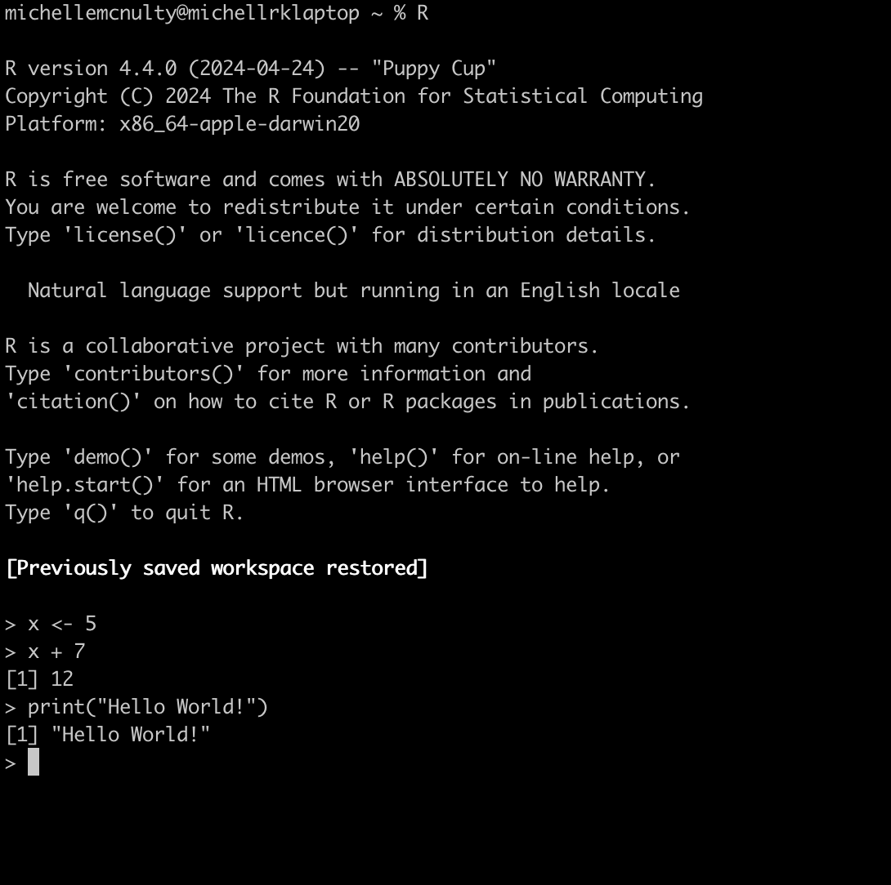
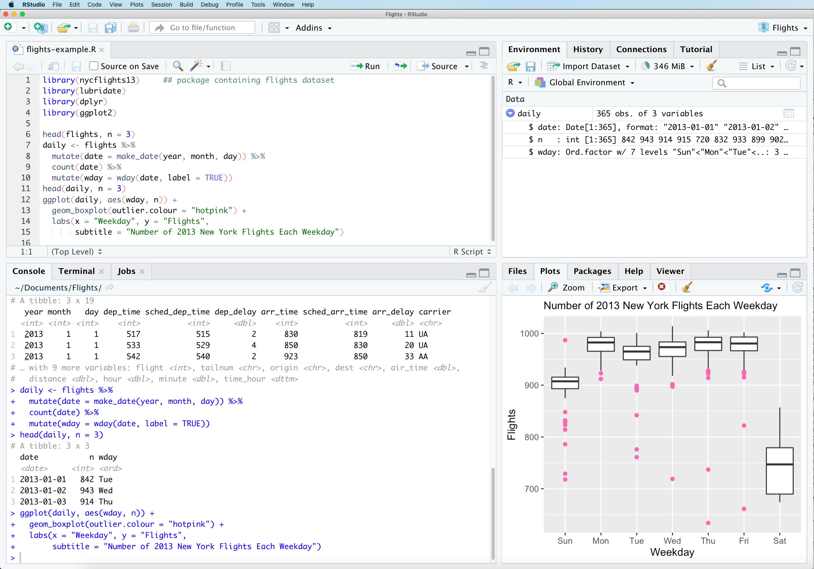
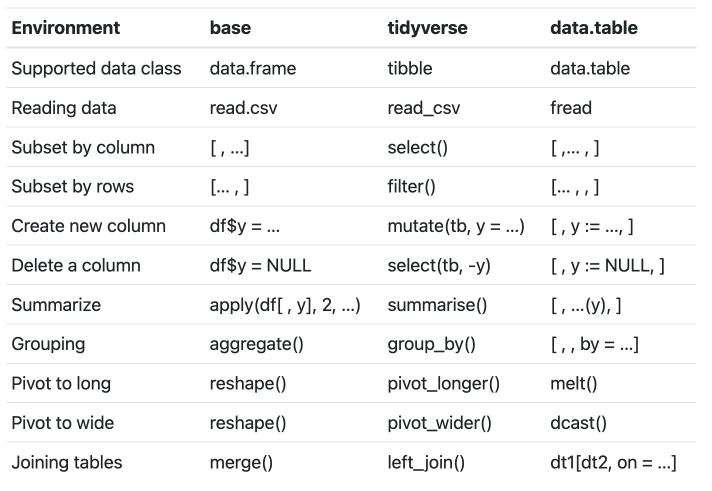
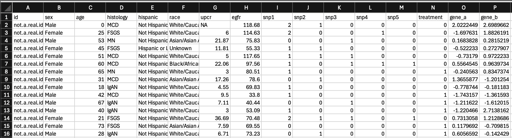
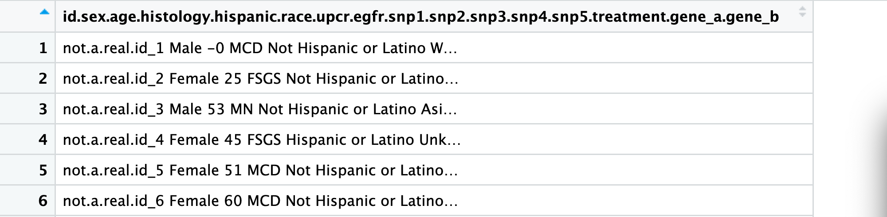
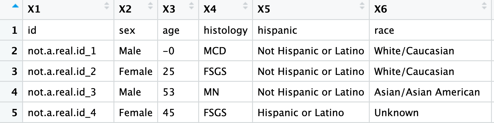
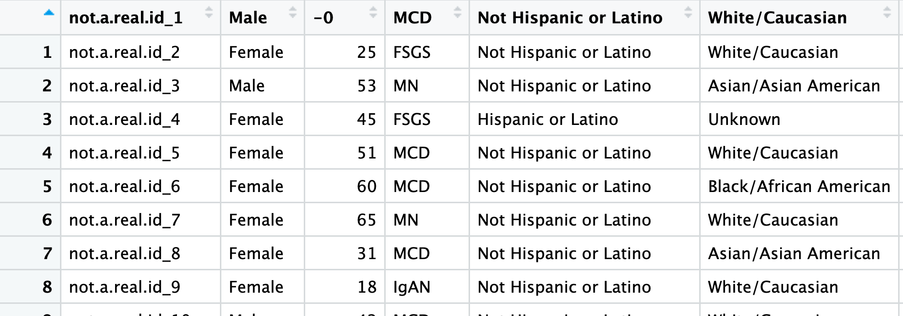
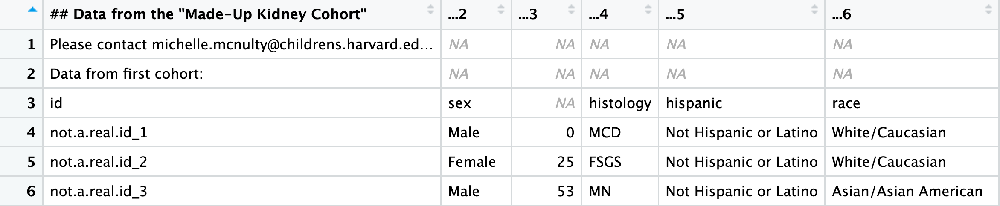
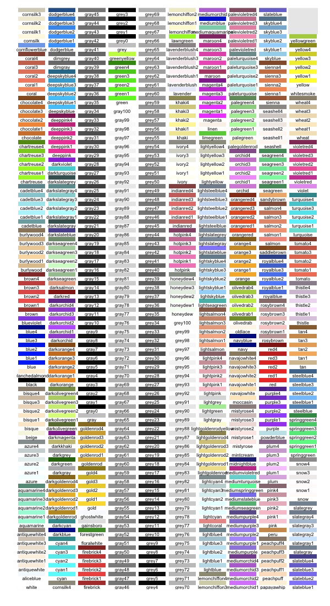
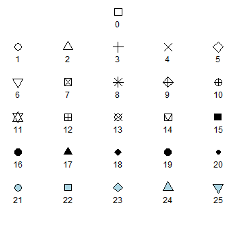

```{r setup, include=FALSE}


library(learnr)
library(gradethis)
library(tidyverse)
library(tableone)
knitr::opts_chunk$set(echo = FALSE)
options(width = 10000)
options(evaluate.new_session = FALSE)
options(tutorial.max.forked.procs=50)

#setwd('/Users/michellemcnulty/BCH Dropbox/Michelle McNulty/r_tutorial/Intro2R/')
some_numbers <- c(10:15)

df <- read_tsv('data/fake_data.tsv')

df_clean <- df %>% filter(!is.na(egfr) & !is.na(upcr))
## Flip treatment indicator 
df_clean$treatment <- ifelse(df_clean$treatment ==1, 0,1)
df_clean$treatment <- factor(df_clean$treatment)


df_clean$ckd <- ifelse(df_clean$egfr < 60, 1, 0)

model1 <- lm(egfr ~ snp1, data=df_clean)
model2 <- lm(egfr ~ snp1 + age + histology, data=df_clean)

model_list <- list()

for (i in 1:5) {
  snp_name <- paste0("snp", i)
  formula_str <- paste("egfr ~", snp_name, "+ age + histology")
  model <- lm(as.formula(formula_str), data = df_clean)
  model_list[[snp_name]] <- model
}


snp_name <- 'snp1'


model <- model_list[[snp_name]]
model_summary <- summary(model)


results <- data.frame()
for (i in 1:5) {
  snp_name <- paste0("snp", i)
  model <- model_list[[snp_name]]
  coef_summary <- summary(model)$coefficients
  new_line <- data.frame(
    snp = snp_name,
    beta = coef_summary[snp_name, "Estimate"],
    se = coef_summary[snp_name, "Std. Error"],
    t = coef_summary[snp_name, "t value"],
    p = coef_summary[snp_name, "Pr(>|t|)"]
  )
  results <- rbind(results, new_line)
}

snp_name <- 'snp1'

tab <- table(df_clean$ckd, df_clean$treatment)

dimnames(tab) <- list(
  "CKD Status" = c("No CKD", "CKD"),
  "Treatment Group" = c("Placebo", "Drug")
)

```

## Introduction

### Learning goals
- Get exposure to R through data-driven learning 
- Understand how to load and clean clinical data
- Fit and interpret simple regression models in R
- Use base R and tidyverse syntax to work with data

### Why R?
- Open source (publicly available to view, modify and distribute for free)
- Easy to share code & works on different platforms
- Large supportive community 
- Many packages and functions to solve many different problems
- Rstudio - interactive interface for data analysis with R

### What this tutorial is not:
- An in depth tutorial on coding in R
- A guide to statistical methods 

But here are some great resources if you're interested in learning more:

- [swirl](https://swirlstats.com/students.html): Interactive R tutorials in Rstudio 
- [Data Science: R Basics](https://pll.harvard.edu/course/data-science-r-basics) offered by Harvard (credit: Rafael Irizarry)
- Basic data wrangling in R with dplyr: [Wrangling penguins](https://allisonhorst.shinyapps.io/dplyr-learnr/#section-welcome) (credit: Allison Horst)
- Master your data visualization with tutorials and guides at [ggplot2tor.com](https://ggplot2tor.com/) (credit: Christian Burkhart)
- Prefer a physical book? Check out [these](https://www.tidyverse.org/learn/#books) 
- Visual learner? Learn by watching on [R screencasts](https://www.rscreencasts.com/)
- Got the code down, but need a stats refresher? Check out [StatQuest](https://www.youtube.com/@statquest/playlists) on YouTube for great explanations of various statistical methods (credits: John Starmer)

## Things to know

### What is the difference between R and RStudio?

**R** is a language and environment for statistical computing and graphics.

Here is what R looks like using the terminal:



**RStudio** is an integrated development environment (IDE) -- a user-friendly interface to help you be more productive with R.

Here is what it looks like when using RStudio... so much better! 



> 💡 Think of R as the engine running under the hood and RStudio as the car dashboard that provides the interface to interact with the engine. You can use R without RStudio, but you can't use RStudio with R. 

___ 

### Necessary Jargon

| Term        | Meaning                                                |
| :---------- | :----------------------------------------------------- |
| *Syntax*      | The "grammar rules" of writing code                    |
| *Object*      | Named storage of data (e.g., `x`, `my_data_frame`)     |
| *Package*     | Extension library you can install and load with built in functions |
| *Environment* | Where your objects and functions live during a session |

___ 

### Syntax 

To code in any language, you must know the syntax. 


#### Table of Beginner R Syntax
| Syntax              | What It Does                                                  |
| :------------------ | :------------------------------------------------------------ |
| `#`                 | Starts a comment (e.g., `# This is a comment`)                |
| `<-`                | Assigns a value to a name (e.g., `x <- 10`)                   |
| `c()`               | Combines values into a vector (e.g., `c(1, 2, 3)`)            |
| `[]`                | Gets part of a vector or data frame (e.g., `x[1]`)           |
| `:`                 | Makes a sequence (e.g., `1:5` gives 1, 2, 3, 4, 5)            |
| `$`                 | Accesses a column in a data frame (e.g., `df$height`)         |
| `()`                | Calls a function and passes arguments (e.g., `mean(x)` calculates the average of x) |
| `help()` or `?`     | Opens help for a function (e.g., `?mean`)                     |

---

> 💡 One nice thing about R is that spacing doesn’t matter. However, using consistent spacing makes your code easier to read (and prettier).


Here are some examplea  using some of this syntax:

```{r syntax, exercise=TRUE}

# Make a vector of numbers 10 through 15
some_numbers <- c(10:15)

# Print the 3rd number in the vector
some_numbers[3]

```
```{r syntax2, exercise=TRUE}

# Calculate mean of the numbers
?mean
mean(some_numbers)

```

___ 

### Style 

There are many R programming styles, each with its own unique syntax. As a learner, this can feel confusing and overwhelming. If you're curious, feel free to go down a "Base R vs. Tidyverse" Reddit rabbit hole. But at the end of the day, what matters most is writing **well-commented, reproducible code** that answers your scientific questions.


These are just some examples of how syntax and functions vary across styles: 


*Table courtesy of Siyue Han, see his full comparison [here](https://jtr13.github.io/cc21fall2/comparison-among-base-r-tidyverse-and-datatable.html)*

> 💡 When you search for tutorials or code help on forums, you will see more than one correct syntax using any of these styles! You don't have to memorize them all, just know they exist.

**For this tutorial, we will use base R and tidyverse syntax.**

One big difference between base R and the Tidyverse is how functions are written and read.

- **Base R**: Think of functions like a math equation, e.g., `y = f(x)` or `output <- processing(input)`
- **Tidyverse**: Think of it like a flowchart: `input -> processing() -> output`.  
  (Note: `->` will actually cause a syntax error in R — instead, we use the **pipe operator** `%>%`  
  which rewrites this as `output <- input %>% processing()`)

Here's an example where two different syntax give the same solution: 
```{r data_class3, exercise=TRUE}
# Create a vector
my_numbers <- c(1,2,3,4,5)

# Sum the numbers in the vector using base R 
result1 <- sum(my_numbers)
print(result1)

# Sum the numbers in the vector using tidyverse 
result2 <- my_numbers %>% sum()
print(result2)

```


___ 

### Data types

| Class        | Description                          | Example           |
| :----------- | :----------------------------------- | :---------------- |
| *numeric*    | Numbers                              | `3.14`            |
| *integer*    | Whole numbers (can indicate with L)  | `5L`              |
| *logical*    | Boolean TRUE/FALSE                   | `TRUE`            |
| *character*  | Text strings                         | `"Lily"`          |


There are also complex and raw numbers, but they are less often used. Using `L` to indicate an integer is also rarely used. 

> 💡 You can do arithmatic with logical data! `TRUE=1` and `FALSE=0`, so `TRUE + TRUE + FALSE = 2` 

___ 

### Data structures

| Data Structure | Description                                                                  | Example Code                                           |
| :------------- | :--------------------------------------------------------------------------- | :----------------------------------------------------- | 
| *vector*       | 1D collection of **same data type**                                              | `c(1, 2, 3)`                                           | 
| *matrix*       | 2D (rows × columns) of **same data type**                                    | `matrix(1:6, nrow = 2)`                                |
| *array*        | N-dimensional of **same data type**                                              | `array(1:8, dim = c(2, 2, 2))`                         |
| *list*         | 1D collection of elements of **any data type**                                        | `list(num = 5, txt = "hi", vec = 1:3)`                 |
| *data frame*   | 2D table of variables (columns) and observations (rows) of **any data type** | `data.frame(food = c("nacho", "burrito"), rank = 1:2)` |

> 💡 Note that matrices and data frames are both 2D, but matrices are all the same data type, while columns of a data frame can be a mixture of data types. 

___ 

Replace the blank space with each of these examples to "assign the object to x" (for example `x <- c(1, 2, 3)`), print to view data structure, and check the data class with the `class()` function.

```{r data_class, exercise=TRUE}
# Create object 
x <- _______

# Print object 
print(x)

# Print class of object 
class(x)
```

Note that when you apply `class()` to a vector, it gives you the type of vector (numeric, character, logical). To confirm the object is a vector, you can use `is.vector()`

```{r data_class0a, exercise=TRUE}
# Create numeric vector 
x1 <- c(1,2,3)

# Print class of numeric vector
class(x1) # "numeric" 

# Confirm it is indeed a vector
is.vector(x1) # "TRUE"
```

```{r data_class0b, exercise=TRUE}
# Create a character vector
x2 <- c('A','B','C')

# Print class of character vector
class(x2) # "character" 

# Confirm it is also a vector
is.vector(x2) # "TRUE"
```

The `is.____()` function works for other types of data as well! 

You can also change the class with `as.____()`

```{r data_class2, exercise=TRUE}

# Assign the number 3.14 to x
x <- 3.14

# Test if x is numeric or a character
is.numeric(x) # "TRUE"

# Convert x to a character and assign to x2
x2 <- as.character(x)

# Check the class of x
is.character(x2)
```

> 💡 Most `numeric` values in R are stored as **doubles** (double-precision floating point).  
> You can check this with `typeof(3.14)` which returns `"double"`, while `class(3.14)` returns `"numeric"`.

___ 


### Indexing in R

Indexing is how you access specific parts of your data. The way you index depends on the **type of object** you're working with.

> 💡 R uses 1-based indexing, so counting starts at 1, not 0 like in Python or C!


##### Vector
Use square brackets `[]` to access elements by position:

```{r vec_index, exercise=TRUE}
my_vec <- c("apple", "banana", "cherry")

# Get the second element
my_vec[2]
```


##### Matrices
Matrices use `[row, column]` indexing:

```{r index2, exercise=TRUE}
my_mat <- matrix(1:9, nrow = 3)
print(my_mat)

# Get the value in the 2nd row, 3rd column
my_mat[2, 3]
```

##### Lists
For indexing, you can use the number or the name (if they exist) of the item you're interested in.

> 💡 Using the name is a more fool-proof choice! 

Lists can be indexed in two ways:

- Use `[[ ]]` when you're reaching into a list to get the actual object.
- Use `[ ]` when you're extracting a piece of the list while keeping it a list.


```{r index3, exercise=TRUE}
my_list <- list(name = "Lily", age = 7, likes = c("lasers", "snacks", "toys"))

# Get the vector of likes using both the position and the name 
my_list[["name"]]
my_list[[1]]

# Returns the actual vector of likes (character vector)
likes_vector <- my_list[["likes"]]
class(likes_vector)  # "character"

# Returns a sublist that still contains the vector
likes_sublist <- my_list["likes"]
class(likes_sublist)  # "list"

```

You can also get items from a list using `$`

```{r index4, exercise=TRUE}
my_list <- list(name = "Lily", age = 7, likes = c("lasers", "snacks", "toys"))

print(my_list$age)
```

##### Data Frames
There are multiple ways to index data frames.

- `df[ , ]` for row/column indexing
- `df$col_name` for columns by name

- If you want a range of columns and all rows, you can leave the row index blank `df[ ,1:4]` will take the first four columns and all rows. 
- Similarly, `df[1:4, ]` will take the first four rows and all columns. 

```{r index5, exercise=TRUE}
my_df <- data.frame(
  pet = c("cat", "dog", "bird"),
  age = c(4, 7, 2)
)

# Get the age of the second pet
my_df[2, "age"]

# Get the whole "pet" column
my_df$pet
```

___ 

### Functions

A **function** is a reusable piece of code that performs a task.
A function takes **inputs** (called *arguments*) and returns an **output**.
R has many built-in functions (like `mean()` or `sum()`), and you can also write your own!
Functions help organize your code, avoid repetition, and make your scripts easier to read and debug.

---

```{r func1, exercise=TRUE}
# Use the mean() function to find the average of some numbers
numbers <- c(5, 10, 15)
mean(numbers)
```

#### Writing Your Own Function
Use the function() keyword to create your own.

```{r func2, exercise=TRUE}
# A simple function that adds 1 to a number
add_one <- function(x) {
  x + 1
}

add_one(5)
```

#### Function with Multiple Inputs

```{r func3, exercise=TRUE}
# A function that adds two numbers
add_numbers <- function(a, b) {
  sum <- a + b
  return(sum)
}

add_numbers(3, 7)
```

#### Try It Yourself!
Write a function called multiply_by_two that multiplies a number by 2. Use the hints if needed! Test your function on different numbers to confirm it works. 

```{r func4, exercise=TRUE}
# A function that multiplys a number by 2
multiply_by_two <- function(x) {
  _________
  _________
}

multiply_by_two(5)
```

```{r func4-hint-1}
The multiply symbol in R is * 
```

```{r func4-hint-2}
copy add_numbers function and modify to multiply by 2
```

```{r func4-solution}
multiply_by_two <- function(x) {
  product <- x*2
  return(product)
}
```

___ 

#### Helpful Hint on Function Arguments
> 💡 When using functions, you might see arguments written **with or without names**. Both options work! 

Let’s use the `round()` function as an example. To learn how any function works, use a question mark (`?`) before the function name to pull up its help page. Scroll down to the **Arguments** section.

```{r func5, exercise=TRUE}
# Print documentation for round function 
?round
```

You’ll see that `round()` takes two arguments:

- `x`: the number you want to round
- `digits`: how many decimal places to round to

Both of the following lines work, and you’ll likely see both styles in your R journey:

```{r func6, exercise=TRUE}
# Use round function with names inputs 
round(x = 3.14159, digits = 2)  

# Use round function with unnames inputs 
round(3.14159, 2) 
```

> 💡 Ooof... that was a lot to remember. Here is a [helpful cheatsheet](https://iqss.github.io/dss-workshops/R/Rintro/base-r-cheat-sheet.pdf) to help you out along the way! 

## Getting started

Phew! Now that the intro is out of the way, let's get to the fun stuff!

### Data Analysis Outline

1. **Clarify the goal**  
   Before diving into the data, make sure you understand the **research question or hypothesis** and what is expected from the analysis.

2. **Load and check your data**  
   Confirm that the data was **imported into R correctly**. Check file paths, variable names, and dimensions to make sure nothing got lost in transfer.
   
3. **Explore and assess the data** 

   Use summaries and visualizations to get to know your dataset: 
    
    🔍 What types of variables are included? (numeric, categorical, dates, etc.)
    
    🔍 Are there any **missing values**?
    
    🔍 What do the distributions look like? Are there **outliers** or unusual values?

4. **Perform the analysis**  
   Once you're confident in the **quality and structure** of your data, begin your planned analysis (e.g., modeling, hypothesis testing).

5. **Interpret the results**  
   What do the results mean in the context of your question? Are they statistically and scientifically sound? Think critically before drawing conclusions.

6. **Communicate your findings**  
   Present your results clearly using **figures, tables, and written summaries**. Consider your audience. What do they need to understand the story your data tells?

## Clarify the goal
- A collaborator has identified genetic variants and a treatment associated with kidney function. They ask you to test these associations in your cohort. You're given a large dataset with the variants of interest, demographics information, therapeutic indicator, and kidney function for each individual in your cohort. They would like a summary of the cohort, i.e. "Table 1", p-values for tested associations, and a few figures for the paper that summarize key findings. 

## Load and check your data
Throughout this workshop, we will work with the `tidyverse` package, a suite of very useful data analysis functions. For more info visit [here](https://www.tidyverse.org/packages/).

```{r library, exercise=TRUE}
#install.packages("tidyverse")
library(tidyverse)
```

### Read in data

Here is what it looks like in Excel: 



There are many functions to load various types of data, `read_tsv()` from the `readr` library (from tidyverse) is one option for tab-separated files. Similarly, `read_csv()` will read in comma-separated files.

```{r read_file, exercise=TRUE}
df <- read_tsv('data/fake_data.tsv')
```

This message is from the `readr` package confirming that your tab-delimited file was read successfully and providing a summary of the column types.

This output also tells you how the function interpreted the types of data:

- These are characters/strings: `chr  (5): id, sex, histology, hispanic, race`
- These are numeric, or "double": `dbl (11): age, upcr, egfr, snp1, snp2, snp3, snp4, snp5, treatment, gene_a, gene_b`

>💡 `df` is a commonly used name for data frames because it's short and easy to type! You can name your data frames anything you'd like, but we suggest keeping names short and informative. Using `df` is fine, but if you end up with `df`, `df2`, `df3`, etc. all in your script, things can quickly become confusing.

```{r quiz1}
quiz(
  question("How many rows are there in the dataset?",
    answer("11"),
    answer("3835", correct = TRUE),
    answer("5000"),
    answer("16"),
    incorrect = "The number of rows is in the log, but you can also try using `nrow(df)` to count the rows.",
    allow_retry = TRUE
))

```

You can also use `nrow()` and `ncol()` or `dim()` to get the number of rows and columns. You can try these functions below. 

```{r get_dim, exercise=TRUE}
nrow()
```

Whoops... We might sneak in a few 'bugs' in the code for you to catch. When using a function in R, you have to define the input. Since our input is the data frame df, update the code to `nrow(df)` or `df %>% nrow()` and run again :) 

**Always make sure the dimensions match what is expected.** In this case we should have 3835 samples/rows and 16 variables/columns. Any deviation might suggest a problem importing the data. 

### Common mistakes when reading in file 

**Wrong delimiter** : Here the tsv file read with `read_csv`. 



**Column name issues** : 

- Case 1: The file has column names, but they were read in as data (row 1)



- Case 2: The file does not have column names, so the first row of data was set as column names



In both cases, the read function will have a command to specify if the file being read in has column names. For example `df <- read_tsv(file_name, col_names=TRUE)`

**Unwanted rows**:



This can be remedied by telling the read function to skip lines. For example, `df <- read_tsv(file_name, skip=3)`. Additionally, you can ignore lines that start with a given character with `df <- read_tsv(file_name, comment = "#")`

### View data
View the data to make sure everything imported correctly. 

`View(df)` will open a new tab in R Studio with the full data set; this will look similar to an excel spreadsheet. However, when data is large, this is not ideal and might crash your RStudio, *and this tutorial*, which would be a real bummer. Instead use the `head()` function to view the first 6 rows. Similarly, `tail()` will give you the last 6 rows.

```{r df2, exercise=TRUE}
head(df)
```

> 💡 Note that there are no spaces in the column names. You *can* have spaces, but it will make coding more difficult. It is common to use underscores or periods instead of spaces, for example 'gene_a'. 

## Column types

We can view data types, or class, for each column. For example, `treatment` is numeric.

- To access a column in the data frame (df), we can use the `$`, so the treatment column would be `df$treatment`. 

- The `class()` function will confirm the data class.

```{r make_factor, exercise=TRUE}
class(df$Treatment)
```

Whoops! R is case-sensitive. "NULL" is telling you that the 'Treatment' column doesn't exist. Update to 'treatment' and run again. 

> 💡 To reduce these types of errors, it is common to stick to lower-case object names. 

We want `treatment` to be a factor (no-treatment=0 vs. treatment=1). This will allow us to treat treatment as a group when performing regression or creating figures. 

You can change the data types in R. To go from numeric to factor we can use the `factor()` function.

```{r make_factor2, exercise=TRUE}
factor(df$treatment)
```

Oooooo...this was not what we expected... We got the function correct, but we need to assign the results back to the treatment column. 
In R, `<-` is used to assign the output of a function somewhere, in this case a column in the data frame. 

```{r make_factor3, exercise=TRUE}
df$treatment <- factor(df$treatment)
class(df$treatment)
```

This time, the result of the function doesn't print to the screen, but is instead assigned to `df$treatment`.

**It's very important to get to know your data thoroughly before conducting statistical analyses**

So now that we know our data has imported correctly, let's check for missing data!


## Missing data

It's important to know which data is missing and why it's missing. Click [here](https://www.ncbi.nlm.nih.gov/books/NBK493614/) to learn more about types of missing data.  

To count the missing values in each column, we will first use `is.na()` to turn each cell in the data frame into a TRUE if missing or FALSE if present. We will then use `colSums()` to count the number of missing values in each column. (NOTE: `rowSums()` will sum across rows. This would be useful if we wanted to know how much missing each sample had.)

**Challenge:** This can be written as a nested function, i.e., one line of code with one function inside the other. Give it a try! And click 'Hint' if needed. 

```{r missing, exercise=TRUE}
missing_count <- is.na(df)
colSums(missing_count)
```

```{r missing-hint-1}
if f(x) = m and g(m) = c, then g(f(x)) = c
```

```{r missing-hint-2}
The solution will not have 'missing_count' in it.
```

```{r missing-solution}
colSums(is.na(df))
```

```{r quiz2}
quiz(
  question("Which columns have missing data",
    answer("age"),
    answer("sex"),
    answer("upcr", correct = TRUE),
    answer("egfr", correct = TRUE),
    allow_retry = TRUE
  ))
```

There are many ways to handle missing data, for example imputation. In this tutorial, we are simply going to remove rows with missing values. 

**But first....** 
We need to learn the `filter()` function from the dplyr package (loaded automatically with tidyverse).

This function is analogous to filtering columns in an excel sheet to create a new subset of the data.

- The tidyverse uses the `%>%` operator to "pipe" data through a sequence of functions.
- In the example below, we’ll use `%>%` to pipe the data frame into the `filter()` function.
- The `filter()` function keeps only the rows that meet the condition(s) you specify. 

Here are some basic logical operators you can use inside `filter()`:

- `==`  equal to
- `>` / `<`  greater than / less than
- `>=` / `<=` greater than or equal to / less than or equal to
- `!=`  not equal to
- `&`  AND (both conditions must be TRUE)
- `|`  OR (at least one condition must be TRUE)
- `is.na` is missing 
- `!is.na` is not missing 

Here are a few examples (note: `head(n=2)` allows us to just view the top of the filtered data, if we didn't include this, the full filtered data frame can overwhelm our screens. Try it out if you're feeling adventurous...) 

```{r filter_missing, exercise=TRUE}
## Keep only male 
df %>% filter(sex == 'Male') %>% head(n=2)

## Keep age 50 and up 
df %>% filter(age >= 50) %>% head(n=2)

## Keep men age 50 and up 
df %>% filter(sex == 'Male' & age >= 50) %>% head(n=2)

## Remove individuals with MN 
df %>% filter(histology != 'MN') %>% head(n=2)

## Keep samples with missing eGFR
df %>% filter(is.na(egfr)) %>% head(n=2)

```

Above we just viewed the head of each subset data frame. Here we assign the filtered dataframe to a new dataframe. 

```{r filter_missing2, exercise=TRUE}

## Keep men >= 50 and create a new data frame 
df_50_men <- df %>% filter(sex == 'Male',  age >= 50) 
```

**Now you try!**
Create a new data frame called `df_clean` that removes samples (rows) with missing *egfr* or *uacr* Use hints when needed! 

```{r filter_missing3, exercise=TRUE} 
____ <- df %>% filter(____, ____)

## Count number of rows in df_clean
nrow(df_clean)
``` 

```{r filter_missing3-hint-1}
`!` = inverse, so if `is.na()` is missing, `!is.na()` would be not missing.
```

```{r filter_missing3-hint-2}
 filter(!is.na(column1), !is.na(column2))
```

```{r filter_missing3-hint-3}
df_clean <- df %>% filter(!is.na(egfr) , !is.na(upcr))
```

```{r filter_missing3-check}
grade_result(
  pass_if(function(result) {
    is.numeric(result) && result == 3331
  }, "Great work!"),
  
  fail_if(function(result) TRUE, "Incorrect. Check your filtering logic.")
)
```

> 💡 As we mentioned, there are many ways to get the job done. `df %>% drop_na(egfr , upcr)` would also work, but the `filter()` function allows for more flexibility.

Check our [this tutorial](https://learnr-examples.shinyapps.io/ex-data-filter/#section-welcome) for more practice on filtering! 

## Distributions of each column 

### Categorical columns
Use the `table()` function to get counts how many individuals are in each group and `prop.table()` to get percentages.  

#### Sex

```{r sex, exercise=TRUE}
table(df_clean$sex) # gives raw counts
prop.table(table(df_clean$sex)) # gives proportions (percentages in decimal form)
```

#### Histology

```{r histology, exercise=TRUE}
table(df_clean$histology)
prop.table(table(df_clean$histology))
```

#### Race/Ethnicity 

```{r race,exercise=TRUE}
table(df_clean$race)
prop.table(table(df_clean$race))
```

```{r race2, exercise=TRUE}
table(df_clean$hispanic)

## Type code below to get the proportion of Hispanic individuals 
_____(_____(_____))
```

```{r quiz3}
quiz(
  question("What proportion of individuals are Hispanic or Latino?",
    answer("13595"),
    answer("0.21",correct = TRUE),
    answer("0.78"),
    answer("0.02"),
    allow_retry = TRUE
  ))
```

### Continuous columns
Measures of central tendency (mean, median), max & min, and standard deviation can all be calculated with the following functions:

#### Age

```{r age, exercise=TRUE}
mean(df_clean$age)
median(df_clean$age)
min(df_clean$age)
max(df_clean$age)
sd(df_clean$age)
```

There is no base R function for mode, you have to write a short function or use another R package. But, very rarely will you need the mode of your data. 
Alternatively, you can use the `summary()` function to get all of these values. If you need standard deviation, it's not included in summary.

```{r age2, exercise=TRUE}
summary(df_clean$age)
sd(df_clean$age)
```

#### UPCR

```{r upcr, exercise=TRUE}
summary(df_clean$upcr)
sd(df_clean$upcr)
```

#### eGFR
Type code to get a summary of egfr values and standard deviation

```{r egfr, exercise=TRUE}


```

```{r egfr-hint-1}
summary(_____)
sd(_____)
```

```{r egfr-solution}
summary(df_clean$egfr)
sd(df_clean$egfr)
```

```{r quiz4}
quiz(
  question("What is the mean and standard deviation for eGFR?",
    answer("6.03, 237.38"),
    answer(" 77.42, 35.49"),
    answer("77.71, 35.49",correct = TRUE),
    answer("77.71, 6.03"),
    allow_retry = TRUE
  ))
```

##  Visualizing Data
There are basic visualization tools in R, like the `plot()` function, and many plotting packages. We find `ggplot` to be the best option for customizing figures. 

The syntax for ggplot is a little different than what we've seen so far. You can customize the figure by adding on new 'layers'. 

**Here is a nice painting analogy of the ggplot layers thanks to chatGPT:**

- Base layer `ggplot(data, aes(...))`
  - This is your blank canvas and palette setup — you’ve chosen the materials and how colors (data) should be organized, but nothing's on the canvas yet.

- `+ geom_*()` layers
  - These are your brushstrokes — the actual painting begins here, each geom layer adds a visual element like dots, lines, or bars.

- `+ labs() + theme()`
  - These are your title, labels, and frame — they don’t change the painting itself but shape how it’s presented.

- `+ facet_*()`
  -  Imagine hanging a series of related paintings in a gallery — each one highlights a different subset of your data.

```{r ggplot, exercise=TRUE}
ggplot(df_clean, aes(x=age, y=egfr))
```

This plot is missing something..... the data! Remember this first layer will only make the "canvas". ggplot needs to know what type of plot we want to apply to the data. 

We have to add on what type of plot we want to use. Some common plots are: 

- scatter plot: *geom_point()*
- histogram: *geom_hist()*
- box plot: *geom_boxplot()*
- bar plot: *geom_barplot()*
- [many more](https://r-graph-gallery.com/ggplot2-package.html)

### Scatter Plots 
Since this example is 2 continuous values, we will add a *geom_point()* layer.

```{r ggplot_scatter1, exercise=TRUE}
ggplot(df_clean, aes(x=age, y=egfr)) + 
  geom_point()
```

Once you get the baseline plot, you can start customizing. 
To make changes to the points, add to the `geom_point()` function. 
Change the code below to see how different sizes, colors (outline), fill (inside), and shapes. 

```{r ggplot_scatter2, exercise=TRUE}
ggplot(df_clean, aes(x=age, y=egfr)) + 
  geom_point(size=5, fill='blue', color='red', shape=24) 
```


 
*NOTE: Only shapes 21-25 have a fill option*

If you want to customize the points based on another variable in the data frame, you have to wrap the customization in `aes()`.
This part is a little confusing, so bear with us...

- If the aestetic is in the `ggplot(aes(_____))` line, the aestetic will apply to every layer of the plot. 
- If the aestetic is in the `geom_*()` function, it will only be applied to that layer. 
- With just one layer, it doesn't matter, but future you might want to get fancier with your figures, so it's good to know.

```{r ggplot_scatter3, exercise=TRUE}
ggplot(df_clean, aes(x=age, y=egfr, size=upcr, color=histology, shape=sex)) + 
  geom_point() 

## Note that this code will make the same plot since there is only one layer (geom_point)
# ggplot(df_clean, aes(x=age, y=egfr)) + 
#   geom_point(aes(size=upcr, color=histology, shape=sex)) 

```

Obviously, this figure is hideous and reviewer #2 is likely going to make you change it. But it's a good start in understanding how to use `aes()` to customize figures. 

Make a scatter plot of gene_a vs. upcr, with point size = 2, and color = histology

```{r ggplot_scatter4, exercise=TRUE, eval=TRUE}

```

```{r ggplot_scatter4-hint-1}
ggplot(df_clean, aes(x=_____, y=_____, color=______)) + 
  geom_point(size=___) 
```

```{r ggplot_scatter4-solution}
ggplot(df_clean, aes(x=gene_a, y=upcr,color=histology)) + 
  geom_point(size=2) 
```

### Histogram
Histograms are great for seeing the distribution of continuous variables

```{r ggplot_histogram1, exercise=TRUE}
ggplot(df_clean, aes(x=upcr)) + 
  geom_histogram()
```

You can see here, that upcr is skewed. Since many analyses assume variables follow a normal distribution, UPCR is often log2 transformed. We add a small number to upcr to avoid taking the log of 0. 

Also... we got a warning. The plot is using `bins=30` as the default, but we can change it to best match the data. Adding `bins=<integer>` will change the number of bars.

  - REMINDER: Since the `bins=___` does not include any data from `df_clean`, it does not need to be wrapped in `aes()`
  - Note that the log2 transform can be applied in the plotting function! Another method would be to make a new column `df_clean$log2upcr <- log2(df_clean$upcr+0.1)`, then plot the new column. 

```{r ggplot_histogram2, exercise=TRUE}
ggplot(df_clean, aes(x=log2(upcr+0.1))) + 
  geom_histogram(bins=40)
```

Oh boy, I'm sure glad we visualized this. We need to think very carefully about how we model UPCR! 

Next, if we want to see how UPCR varies across groups, we can stratify the distribution by any categorical variable using `fill=____`. 

The options for `position=` are 'identity', 'dodge' and 'stack'. Try them all to see how they look! You can also adjust `alpha=<0 to 1>` to change the transparency of the bars.

```{r ggplot_histogram3, exercise=TRUE}
ggplot(df_clean, aes(x=log2(upcr), fill=sex)) + 
  geom_histogram(position='identity', alpha=0.5, bins=20)
```

ggplot comes with different available themes. Try adding these themes to the egfr histogram to see how it changes:

- theme_classic()
- theme_bw()
- theme_light()
- theme_dark()
- theme_minimal()
- theme_void()

```{r ggplot_histogram4, exercise=TRUE}
ggplot(df_clean, aes(x=egfr, fill=sex)) + 
  geom_histogram(position='dodge', bins=50) +
  theme_classic()
```

Make a histogram plot of age stratified by histology with overlapping histograms

```{r ggplot_histogram5, exercise=TRUE, eval=TRUE}

```

```{r ggplot_histogram5-hint-1}
ggplot(df_clean, aes(x=_____, fill=_____)) + 
  geom_histogram() 
```

```{r ggplot_histogram5-solution}
ggplot(df_clean, aes(x=age, fill=histology)) +
  geom_histogram() 
```

> 💡 There's a weird shared pattern across histologies, which is likely an artifact of the simulated data. You can still learn a lot by investigating these anomalies though! Once, we noticed an unexpected peak in eGFR at 150. After investigating, we found that one lab truncated their eGFR values where anything greater than 150 was set to exactly 150. This ended up changing how we analyzed the data.

## Perform the analysis #1

Let's test if the genetic variants (SNP1-5) are associatied with kidney function. Since eGFR is continuous and approximately normally distributed, we can use linear regression with th `lm(Y ~ X, data=<dataframe>)` function.

This is a model that tests the effect of the SNP (independent variable) on eGFR (dependent variable). This is the unadjusted model since we have not included covariates, for example age or sex. 

```{r lm1, exercise=TRUE}
model1 <- lm(egfr ~ snp1, data=df_clean)
summary(model1)
```

#### Interpreting the Model Summary

**Call**: The regression model used.

**Residuals**: Summary of the distribution of residuals. Symmetric residuals centered around 0 suggest a good model fit.

**Coefficients**:

  - *Estimate*: The estimated effect size (beta) for the intercept and each independent variable.  
  - *Std. Error*: The standard error of the estimate.  
  - *t value*: Estimate divided by Std. Error; used to test whether the coefficient is significantly different from 0.  
  - *Pr(>|t|)*: The p-value; the probability of observing a t-value as extreme or more extreme than the one calculated if the predictor had no effect (null hypothesis).

#### Model Diagnostics

**Residual Standard Error (RSE)**: The estimated standard deviation of the residuals — how far, on average, your model’s predictions are from the actual observed values, in the same units as the outcome variable.

**Multiple R-squared**: The proportion of variance in the outcome (dependent variable) that is explained by the model.

**Adjusted R-squared**: R-squared adjusted for the number of independent variables in the model. Use this when comparing models with different numbers of predictors.

**F-statistic**: A global test of model significance.
  - Null hypothesis (H₀): All regression coefficients (except the intercept) are equal to 0.

**p-value (for F-statistic)**: The probability of observing an F-statistic as large as the one calculated if the null hypothesis were true.


```{r quiz5}
quiz(
  question("What does a negative coefficient for SNP1 in the linear model suggest?",
    answer("Individuals with the effect allele have lower eGFR on average.", correct = TRUE),
    answer("The model failed to converge."),
    answer("SNP1 is not associated with eGFR."),
    answer("The SNP1 allele increases eGFR."),
    allow_retry = TRUE
  )
)

```
___

### Adjust for covariates
This model includes age and histology as a covariates, both are known to be associated with eGFR. 

To add covariates, use the `+` sign: `lm(Y ~ X1 + X2 + X3 + ... + XN, data=<dataframe>)` 

```{r lm2, exercise=TRUE}
model2 <- lm(egfr ~ snp1 + age + histology, data=df_clean)
summary(model2)

```

You can use the model diagnostics to see if adding the covariates resulted in a better fit. 

  - The adjusted R-squared for the adjusted model (R^2^~adj~=0.23), is greater than the adjusted R-squared from the simpler model with only snp1 (R^2^~adj~=0.01), indicating `age` and `histology` improve our model. 
 
  - Note that the *results for the categorical histology covariate look different than the continuous age covariate.* 
  - FSGS is not included in the output becuase it is the reference group. 
  - You can change the reference group if needed using the `relevel()` function.

```{r quiz6}
quiz(
  question("What does a p-value of 0.02 for SNP1 indicate?",
    answer("There is a 2% chance the result is a false positive."),
    answer("There is strong evidence that SNP1 is associated with eGFR.", correct = TRUE),
    answer("SNP1 causes a decrease in eGFR."),
    answer("SNP1 should be removed from the dataset."),
    allow_retry = TRUE
  )
) 

```
___ 

You can also visually assess the models with with diagnostic plots. See [HERE](https://library.virginia.edu/data/articles/diagnostic-plots) for more details on each diagnostic plot.

```{r lm3, exercise=TRUE }
plot(model2)
```

For more details on linear models and diagnostics in R, check out this [lesson on Data Camp](https://www.datacamp.com/tutorial/linear-regression-R) and this [cheat sheet from Code Academy](https://www.codecademy.com/learn/learn-linear-regression-in-r/modules/linear-regression-in-r/cheatsheet) 

### Running multiple tests
We want to test association with each SNP, but copying the regression code could get tedious, especially if there are more than 5. To make this efficient, we must first review loops and lists.

### For Loops 

There are a few types of loops, but for this analysis, we will use a `for loop`. Check out [this tutorial](https://intro2r.com/loops.html) to learn more about loops!

- A `for loop` runs the same code once for each value in a sequence.
- This loop runs 5 times where `i` takes a value from 1 to 5. (`1:5` in R will create the sequence `1,2,3,4,5`)
- The code inside the {} is executed for each value of i.
- You need to use the `print()` function to print each output to your screen 

Play with the code below to see what else you can do with `i`! Loop through the hints for different examples. 

```{r loop, exercise=TRUE}
for (i in 1:5) {
  print(i)
}
```

```{r loop-hint-1}
for (i in 1:5) {
  print(i + 5)
}
```

```{r loop-hint-2}
for (i in 1:5) {
  x <- i*20
  print(x)
}
```

```{r loop-hint-3}
for (i in 1:5) {
  snp_name <- paste0("snp", i)
  print(snp_name)
}
```

```{r loop-hint-4}
for (i in 1:5) {
  dataframe_id <- df_clean[i, 'id']
  print(dataframe_id)
}
```

### Lists

- A list can store a collection of elements of different types and sizes
- Use `[[<list_item>]]` to access list element

```{r lists, exercise=TRUE}
my_list <- list(
  name = "Joseph",
  age = 9,
  egfr = c(90, 85, 92),
  info = data.frame(height = 165, weight = 60)
)

## You can also add new items to the list
my_list[["histology"]] <- "FSGS"

print(my_list)
```

### Putting it together: Saving linear regression results in a list using a loop
- Since we want to run the loop for snp1 to snp5, we will use `i` as a place holder for 1 to 5, since this is the only part of our model that changes.
- Since the SNP id is snp*i* and not just *i*, we can use the `paste()` function to put the two strings together. 
  - The default is to add a space between each string. We can update this with `sep=''`, which tells the paste function to paste the strings with no space in between. 

> 💡 Before running the loop, it's helpful to troubleshoot the code on one element and print intermediate values to make sure the code is doing what you want it to do. It usually takes a few tries to get what you want! 

```{r lm_list, exercise=TRUE}

i <- 1
snp_name <- paste("snp", i, sep='')
print(snp_name)

formula_str <- paste("egfr ~", snp_name, "+ age + histology")
print(formula_str)

model <- lm(as.formula(formula_str), data = df_clean)
print(model)

```

It looks good :) Now we can run for all SNPs!

- You can create an empty list with `list()` 
- The results from each of the regression models can be added as list items!

```{r lm_list1, exercise=TRUE}

model_list <- list() #Create empty list to store results for each SNP

for (i in 1:5) {
  snp_name <- paste0("snp", i)
  formula_str <- paste("egfr ~", snp_name, "+ age + histology") # Dynamically create the formula string since the SNP ID will change with the loop
  model <- lm(as.formula(formula_str), data = df_clean)
  model_list[[snp_name]] <- model
}

print(model_list)
```

You can view the summary for each SNP by using the list index

```{r lm_list2, exercise=TRUE}

summary(model_list[['snp1']])

```

Modify the code above to answer this question: 

```{r quiz7}
quiz(
  question("What is the estimated effect size and p-value for SNP3?",
    answer("-2.20, < 2.2e-16"),
    answer("-0.64, 0.22"),
    answer("-2.20, 0.01", correct = TRUE),
    answer("-0.64, <2e-16"),
    allow_retry = TRUE
  ))
```

If we had more than 5 models, going through each on their own would be tedious. We can create another loop to go through and get the summary stats we're interested in. 

Again, it's easier to start with the first in the loop and add the loop once you know the code is doing what you want it to do. 

```{r lm_list4, exercise=TRUE}

i <- 1
snp_name <- paste("snp", i, sep='') ## Make SNP ID 
print(snp_name)

model <- model_list[[snp_name]] # Retrieve the model for the selected SNP
model_summary <- summary(model) # Use the summary() function to get the model summary, which contains the effect size and pvalue we're interested in
print(model_summary)
```

Now we see the model summary, we need to extract pieces we're interested in?

One way to see the structure of an object is with `str()` function.

```{r lm_list5, exercise=TRUE}
str(model_summary)
```

You can see here that `model_summary` is a list with 11 items.

Since we're interested in the `coefficients` section, we can extract just this item using `$`, just like we did to get columns in our data frame! 

```{r lm_list6, exercise=TRUE}
model_summary$coefficients
```

Now we're only interested in the row with the SNP ID. Remember we can index a matrix with `[row,column]`, since we want the row with the SNP id and all columns, we can do this: 

```{r lm_list7, exercise=TRUE}
model_summary$coefficients[snp_name,]
```

> 💡 Leaving the index blank (like the column index above) will return all the rows or columns. 

If we want a specific column, we can indicate it in the column index. 

```{r lm_list8, exercise=TRUE}
model_summary$coefficients[snp_name,"Estimate" ]
```

We can do the same to get the standard error, t-value and p-value. 

**Let's put it all together!**

This code looks intimidating, but let's break it down line-by-line

  - `results <- data.frame()` create an empty data frame called 'results'. This will give us an object to add new lines to 
  
  - `for (i in 1:5) {` loop through numbers 1 to 5
  
  - `snp_name <- paste0("snp", i)` create the SNP name, as we did above
  
  - `model <- model_list[[snp_name]]` get the model for the SNP
  
  - `model_summary <- summary(model)` generate the model summary
  
  - `coef_summary <- model_summary$coefficients` get the coefficients from the model 
  
  - `new_line <- data.frame(` Create a data frame called 'new_line' with the model information we're interested in
  
  - `snp = snp_name` Create a column called 'snp' and assign the 'snp_name'
  
  - ` beta = coef_summary[snp_name, "Estimate"]` Get the beta for the SNP, same for `se`, `t`, and `p`
  
  - `results <- rbind(results, new_line)` Add the new line to the results data frame using the row binding function `rbind()`
  
```{r lm_list9, exercise=TRUE}
results <- data.frame()

for (i in 1:5) {
  snp_name <- paste0("snp", i)
  model <- model_list[[snp_name]]
  model_summary <- summary(model)
  coef_summary <- model_summary$coefficients
  new_line <- data.frame(
    snp = snp_name,
    beta = coef_summary[snp_name, "Estimate"],
    se = coef_summary[snp_name, "Std. Error"],
    t = coef_summary[snp_name, "t value"],
    p = coef_summary[snp_name, "Pr(>|t|)"]
  )
  results <- rbind(results, new_line)
}

print(results)

```

### Multiple testing correction

Multiple testing correction is a statistical procedure that adjusts for the increased risk of false positives when performing multiple hypothesis tests. 

*Check out [this lesson](https://stats.libretexts.org/Bookshelves/Applied_Statistics/Biological_Statistics_(McDonald)/06%3A_Multiple_Tests/6.01%3A_Multiple_Comparisons) to learn more about multiple testing.*  

You can use the `p.adjust()` function to generate adjusted p-values. Here we use it using the Benjamini & Hochberg false discovery rate (FDR) method. 

```{r adjust0, exercise=TRUE}
p.adjust(results$p, method='fdr') ## 'bh' will also work :) 
```

Now use what you've learned to assign these adjusted p-values to a new column called `adj_p` in the `results` data frame. 
```{r adjust, exercise= TRUE}
___PUT YOUR CODE HERE_________ 

print(results)
```

```{r adjust-hint-1}
____$____ <- p.adjust(______) 
```

```{r adjust-hint-2}
____$____ <- p.adjust(results$p, method='fdr') 
```

```{r adjust-hint-3}
results$adj_p <- p.adjust(results$p, method='fdr') 
```

View the updated results table to answer the question below


```{r quiz8}
quiz(
  question("Which statement(s) are accurate? (significance = p<0.05)",
    answer("SNP1 and SNP3 are significant before multiple testing correction.", correct = TRUE),
    answer("There are three SNPs significant before multiple testing correction."),
    answer("After multiple testing correction, only SNP1 is significant"),
    answer("After multiple testing correction, SNP1 and SNP3 is significant", correct = TRUE),
    allow_retry = TRUE
  ))
```


## Perform the analysis #2

Let's see if the treatment is associated with CKD. 

First we need to make a new column to define CKD as eGFR < 60. 

We can do this with an `ifelse()` statement. 

- The syntax is: `ifelse(statement, true_response, false_response)` — if statement is TRUE, it returns true_response; if FALSE, it returns false_response.

Here is an example:

```{r ifelse, exercise=TRUE}

ifelse(5>2, 'this inequality is TRUE', 'this inequality is FALSE')

```

Now lets make a binary indicator (0/1) for CKD that we can use in our regression model. 

Make a new column called `ckd` and return 1 if eGFR < 60, else return 0.  

```{r add_ckd, exercise = TRUE}
____ <- ifelse(____, ____, ____)
```

```{r add_ckd-hint-1}
df_clean$___ <- ifelse(df_clean$___ < __, ____, ____)
```

```{r add_ckd-solution}
df_clean$ckd <- ifelse(df_clean$egfr < 60, 1, 0)
```

Before we do a regression analysis, we can make a 2x2 table to see how the counts are distributed.
As we did before, we will use the table() function — but this time, we’ll include two variables.

Since a table with only '0' and '1' labels can be confusing, we can add labels by assigning a list of labels to the tables `dimnames()`. 

> 💡 Be careful when assigning names. It helps to view the table without the names first to make sure you know the levels. It's always smart to build in sanity checks to make sure your numbers add up correctly. 

```{r 2table, exercise = TRUE}

tab <- table(df_clean$ckd, df_clean$treatment)

dimnames(tab) <- list(
  "CKD Status" = c("No CKD", "CKD"),
  "Treatment Group" = c("Placebo", "Drug")
)

print(tab)
```

It’s good to see a decent sample size in each bin. If counts are too low, we’d have to think carefully about how we test for significance.

You can also use prop.table() again to see percentages in each group.
We can customize this table to indicate how the percentages are distributed:
- To make rows sum to 100%, use `prop.table(tab, 1)`
- To make columns sum to 100%, use `prop.table(tab, 2)`
- To make all cells add to 100%, omit the second input: `prop.table(tab)`

```{r 2table2, exercise = TRUE}
prop.table(tab,2)
```

```{r quiz9}
quiz(
  question("Which of the following are true:",
    answer("50% of participants took the drug and do not CKD", correct = TRUE),
    answer("13% of participants took the placebo and have CKD", correct = TRUE),
    answer("Of the participants that took the drug, 27% have CKD", correct = TRUE),
    answer("Of the participants that took the placebo, 45% have CKD", correct = TRUE),
    answer("The drug apprears to protect from CKD", correct = TRUE),
    allow_retry = TRUE
  ))
```

Great, now let's test this statistically. Since our dependent variable CKD is binary, we will use logistic regression. 

To do this, we will use the `glm()` function, which fits a [generalized linear model](https://sscc.wisc.edu/sscc/pubs/glm-r/), using the binomial link function (transformation done on the response variable). 

```{r logistic, exercise = TRUE}
fit <- glm(ckd ~ treatment , data=df_clean, family='binomial')
summary(fit)
```

**Very important**: The Estimate from a logistic regression model represents the log of the odds ratio (log-odds). To obtain the odds ratio (OR), you need to exponentiate the estimate: `OR = exp(Estimate)`

Use the code block below to print the odds ratio for the treatment. 

```{r or_quiz, exercise = TRUE}

```

```{r or_quiz-hint-1}
exp(Estimate)
```

```{r or_quiz-hint-2}
exp(-0.78649)
```

```{r or_quiz-check}
grade_result(
  pass_if(function(result) {
    is.numeric(result) && result == exp(-0.78649)
  }, "Great work!"),
  
  fail_if(function(result) TRUE, "Incorrect.")
)
```

Exciting! The association is significant! 

But hold up... we know lower eGFR and CKD are associated with age. Let's run an adjusted model.

```{r logistic_adj, exercise = TRUE}
fit <- glm(ckd ~ treatment + age , data=df_clean, family='binomial')
summary(fit)
```

```{r quiz10}
quiz(
  question("Which of the following are true:",
    answer("Treatment is no longer associated with CKD (P=0.09)"),
    answer("Treatment is no longer associated with CKD (P=0.76)", correct = TRUE),
    answer("Age is significantly associated with CKD (P<2e-16)", correct = TRUE),
    answer("It is very important to adjust for potential confounders!",correct = TRUE),
    allow_retry = TRUE
  ))
```


## Interpret the results

**FOR MICHELLE: Will add this part last based on what the rest of the tutorial looks like**

## Communicate your findings

### Create Table 1

The `TableOne` package is great for creating summary tables. [Click here](https://cran.r-project.org/web/packages/tableone/vignettes/introduction.html) for more on the `tableone` R package  
`CreateTableOne()` will take the input data and create a summary table of all columns. 

```{r tableone, exercise=TRUE}
library(tableone)
tab1 <- CreateTableOne(data = df_clean)
print(tab1)
```

If you scroll to the bottom, you can see the variables we care about. We obviously don't need to know that there's one of each ID. 

There are many formatting options with `TableOne`. Below, we can select the variables we want in the table and indicate which are categorical. 

- Make a list of all variables to include and call it `vars`
- Make a subset of `vars` with only categorical variables called `cat_vars` 😺

```{r tableone2, exercise=TRUE}
vars <- c("sex", "age", "histology", "hispanic", "race", "upcr", "egfr", "treatment")
cat_vars <- c("sex", "histology", "hispanic", "race", "treatment")

tab1 <- CreateTableOne(vars = vars, data = df_clean, factorVars = cat_vars)
print(tab1)
```

You can also use `strata` to compare two different groups, for example cases vs. controls in a clinical study. This will also add a p-value comparing groups! (see the docs to learn more about statistical tests)

```{r tableone3, exercise=TRUE}
vars <- c("sex", "age", "histology", "hispanic", "race", "upcr", "egfr")
cat_vars <- c("sex", "histology", "hispanic", "race")

tab1 <- CreateTableOne(vars = vars, data = df_clean, factorVars = cat_vars, strata = "treatment")
print(tab1)
```

Lots of significant differences. Given we would want the treatment to be randomized, this might be a red flag. Store this somewhere in your brain for now...

If using these results in a paper, make sure to use the correct tests! For example, UPCR is not normally distributed, so assumptions would be violated in the default t-test. 

```{r tableone4, exercise=TRUE}
vars <- c("sex", "age", "histology", "hispanic", "race", "upcr", "egfr")
cat_vars <- c("sex", "histology", "hispanic", "race")

tab1 <- CreateTableOne(vars = vars, data = df_clean, factorVars = cat_vars, strata = "treatment")
print(tab1, nonnormal='upcr')
```

*Notice the P-value for UPCR is less significant when using the correct test. 

Exercise: Create a Table that summarizes age, race, histology, and eGFR stratified by "snp1"

```{r tableone5, exercise=TRUE}

```

```{r tableone5-hint-1}
Look at code above and make changes for this table. Note that if 'snp1' is the strata, it needs to be included as a variable 

vars <- c(_____)
cat_vars <- c(_____)

tab1 <- CreateTableOne(______)
print(tab1)

#Don't forget R is case-sensitive 
```

```{r tableone5-solution}
## Solution: 
vars <- c("age", "race", "histology", "egfr")
cat_vars <- c("race", "histology")

tab1 <- CreateTableOne(vars = vars, data = df_clean, factorVars = cat_vars, strata = 'snp1')
print(tab1)

```

```{r quiz11}
quiz(
  question("Which variable(s) have a significant association with snp1? (check all that apply)",
    answer("age"),
    answer("race"),
    answer("histology"),
    answer("egfr", correct = TRUE),
    allow_retry = TRUE
  ))
```


___ 

**FOR MICHELLE: Add conclusion - maybe try yourself regression and results for the treatment variable**


