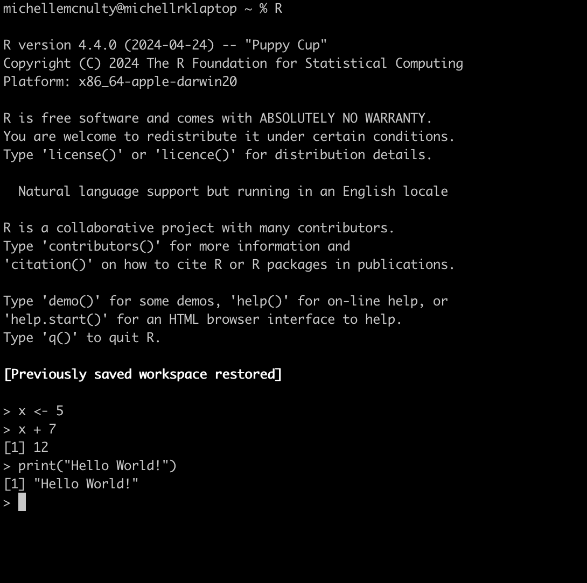

```{r setup, include=FALSE}


library(learnr)
#library(gradethis)
library(tidyverse)
#library(tableone)
knitr::opts_chunk$set(echo = FALSE)
options(width = 10000)
options(evaluate.new_session = FALSE)
options(tutorial.max.forked.procs=50)
my_numbers <- c(1,2,3,4,5)
#setwd('/Users/michellemcnulty/BCH Dropbox/Michelle McNulty/r_tutorial/Intro2R/')
some_numbers <- c(10:15)
```

## Introduction

### Learning goals
- Get exposure to common R syntax
- Understand difference between base R and tidyverse syntax 
- Learn common data structures and types
- Learn how to index objects 

### Why R?
- Open source (publicly available to view, modify and distribute for free)
- Easy to share code & works on different platforms
- Large supportive community 
- Many packages and functions to solve many different problems
- Rstudio - interactive interface for data analysis with R

### What this tutorial is not:
- An in depth tutorial on coding in R
- A guide to statistical methods 

But here are some great resources if you're interested in learning more:

- [swirl](https://swirlstats.com/students.html): Interactive R tutorials in Rstudio 
- [Data Science: R Basics](https://pll.harvard.edu/course/data-science-r-basics) offered by Harvard (credit: Rafael Irizarry)
- Basic data wrangling in R with dplyr: [Wrangling penguins](https://allisonhorst.shinyapps.io/dplyr-learnr/#section-welcome) (credit: Allison Horst)
- Master your data visualization with tutorials and guides at [ggplot2tor.com](https://ggplot2tor.com/) (credit: Christian Burkhart)
- Prefer a physical book? Check out [these](https://www.tidyverse.org/learn/#books) 
- Visual learner? Learn by watching on [R screencasts](https://www.rscreencasts.com/)
- Got the code down, but need a stats refresher? Check out [StatQuest](https://www.youtube.com/@statquest/playlists) on YouTube for great explanations of various statistical methods (credits: John Starmer)

## Things to know

### What is the difference between R and RStudio?

**R** is a language and environment for statistical computing and graphics.

Here is what R looks like using the terminal:



**RStudio** is an integrated development environment (IDE) -- a user-friendly interface to help you be more productive with R.

Here is what it looks like when using RStudio... so much better! 


> 💡 Think of R as the engine running under the hood and RStudio as the car dashboard that provides the interface to interact with the engine. You can use R without RStudio, but you cannot use RStudio without R. 

___ 

### Necessary Jargon

| Term        | Meaning                                                |
| :---------- | :----------------------------------------------------- |
| *Syntax*      | The "grammar rules" of writing code                    |
| *Object*      | Named storage of data (e.g., `x`, `my_data_frame`)     |
| *Package*     | Extension library you can install and load with built in functions |
| *Environment* | Where your objects and functions live during a session |

___ 

### Syntax 

To code in any language, you must know the syntax. 


#### Table of Beginner R Syntax
| Syntax              | What It Does                                                  |
| :------------------ | :------------------------------------------------------------ |
| `#`                 | Starts a comment (e.g., `# This is a comment`)                |
| `<-`                | Assigns a value to a name (e.g., `x <- 10`)                   |
| `c()`               | Combines values into a vector (e.g., `c(1, 2, 3)`)            |
| `[]`                | Gets part of a vector or data frame (e.g., `x[1]`)            |
| `:`                 | Makes a sequence (e.g., `1:5` gives 1, 2, 3, 4, 5)            |
| `$`                 | Accesses a column in a data frame (e.g., `df$height`)         |
| `()`                | Calls a function and passes arguments (e.g., `mean(x)` calculates the average of x) |
| `help()` or `?`     | Opens help for a function (e.g., `?mean`)                     |

---

> 💡 R is 1-indexed meaning counting starts at 1. This is different from other programming languages, like python, that are 0-indexed.
 
> 💡 One nice thing about R is that spacing doesn’t matter. However, using consistent spacing makes your code easier to read (and prettier).


Here are some examples using some of this syntax:

```{r syntax, exercise=TRUE}

# Make a vector of numbers 10 through 15
some_numbers <- c(10:15)

# Print the vector
print(some_numbers)

# Print the 3rd number in the vector
some_numbers[3]

```

```{r syntax2, exercise=TRUE}

# Calculate mean of the numbers
?mean
mean(some_numbers)

```

___ 

## Style 

There are many R programming styles, each with its own unique syntax. As a learner, this can feel confusing and overwhelming. If you're curious, feel free to go down a "Base R vs. Tidyverse" Reddit rabbit hole. But at the end of the day, what matters most is writing **well-commented, reproducible code** that answers your scientific questions.


These are just some examples of how syntax and functions vary across styles: 


*Table courtesy of Siyue Han, see his full comparison [here](https://jtr13.github.io/cc21fall2/comparison-among-base-r-tidyverse-and-datatable.html)*

> 💡 When you search for tutorials or code help on forums, you will see more than one correct syntax using any of these styles! You don't have to memorize them all, just know they exist.

**For this tutorial, we will use a mixture of base R and tidyverse syntax.**

One big difference between base R and the Tidyverse is how functions are written.

- **Base R**: Think of functions like a math equation, e.g., `y = f(x)` or `output <- processing(input)`
- **Tidyverse**: Think of it like a flowchart: `input -> processing() -> output`.  
  (Note: `->` will actually cause a syntax error in R — instead, we use the **pipe operator** `%>%`  
  which rewrites this as `output <- input %>% processing()`). You can also use Tidyverse to chain commands together `input %>% proccess1() %>% process2() .... %>% output`. 

Here's an example where two different syntax give the same solution: 
```{r data_class3, exercise=TRUE}
# Create a vector
my_numbers <- c(1,2,3,4,5)

# Sum the numbers in the vector using base R 
result1 <- sum(my_numbers)
print(result1)

# Sum the numbers in the vector using tidyverse 
result2 <- my_numbers %>% sum()
print(result2)

```

There are different reasons to choose one over the other. For example, base R might have better compute performance for specific tasks, and tidyverse requires other R packages to be installed (dependencies).

We often use base R syntax for simple single functions. But, for long lines of code with a series of functions, tidyverse is easier to understand.
```{r long_lines, exercise=TRUE}
## Short line of code

#base R
mean(my_numbers)
# tidyverse 
my_numbers %>% mean()

## Longer line of code with multiple functions (using cars, a built-in dataframe in R)

# base R
mean(cars[which(cars$speed > 10),]$dist)
# tidyverse
cars %>% filter(speed > 10)  %>% pull(dist) %>% mean()
```

___ 

## Data types

| Class        | Description                          | Example           |
| :----------- | :----------------------------------- | :---------------- |
| *numeric*    | Numbers                              | `3.14`            |
| *integer*    | Whole numbers (can indicate with L)  | `5L`              |
| *logical*    | Boolean TRUE/FALSE                   | `TRUE`            |
| *character*  | Text strings                         | `"Lily"`          |


There are also complex and raw numbers, but they are less often used. Using `L` to indicate an integer is also rarely used. 

> 💡 You can do arithmatic with logical data! `TRUE=1` and `FALSE=0`, so `TRUE + TRUE + FALSE = 2` 

___ 

## Data structures

| Data Structure | Description                                                                  | Example Code                                           |
| :------------- | :--------------------------------------------------------------------------- | :----------------------------------------------------- | 
| *vector*       | 1D collection of **same data type**                                              | `c(1, 2, 3)`                                           | 
| *matrix*       | 2D (rows × columns) of **same data type**                                    | `matrix(1:6, nrow = 2)`                                |
| *array*        | N-dimensional of **same data type**                                              | `array(1:8, dim = c(2, 2, 2))`                         |
| *list*         | 1D collection of elements of **any data type**                                        | `list(num = 5, txt = "hi", vec = 1:3)`                 |
| *data frame*   | 2D table of variables (columns) and observations (rows) of **any data type** | `data.frame(food = c("nacho", "burrito"), rank = 1:2)` |
| *tibble*       | tidyverse-stype 2D table  of **any data type** | `tibble(food = c("nacho", "burrito"), rank = 1:2)` |

Tibbles and data frames are very similar. We won't go into detail here, but if you're interested, check out [this comparison](https://cran.r-project.org/web/packages/tibble/vignettes/tibble.html).

> 💡 Note that matrices and data frames are both 2D, but matrices are all the same data type, while columns of a data frame can be a mixture of data types. 

___ 

Replace the blank space (  ) with each of these examples to "assign the object to x" (for example `x <- c(1, 2, 3)`), print to view data structure, and check the data class with the `class()` function.

```{r data_class, exercise=TRUE}
# Create object 
x <- _______

# Print object 
print(x)

# Print class of object 
class(x)
```

Note that when you apply `class()` to a vector, it gives you the type of vector (numeric, character, logical). To confirm the object is a vector, you can use `is.vector()`

```{r data_class0a, exercise=TRUE}
# Create numeric vector 
x1 <- c(1,2,3)

# Print vector 
print(x1)

# Print class of numeric vector
class(x1) # "numeric" 

# Confirm it is indeed a vector
is.vector(x1) # "TRUE"
```

```{r data_class0b, exercise=TRUE}
# Create a character vector
x2 <- c('1','2','A','B')

#Print vector
print(x2)

# Print class of character vector
class(x2) # "character" 

# Confirm it is also a vector
is.vector(x2) # "TRUE"
```

> 💡 Note that the characters are printed with quotes. If you ever see numbers printed with quotes, they're not numeric! 

The `is.____()` function works for other types of data as well! 

You can also change the class with `as.____()`. 

Having the correct data format can make or break your statistical analyses and figures! For example, if your numeric column is accidentally coded as `c("0.1", "1.3", "2.7" ...)`, the corresponding regression model will interpret the values as categories, not continuous values. 

```{r data_class2, exercise=TRUE}

# Assign the number 3.14 to x
x <- 3.14

# Print - notice there are no quotes
print(x)

# Test if x is numeric or a character
is.numeric(x) # "TRUE"

# Convert x to a character and assign to x2
x2 <- as.character(x)

# Print - now there are quotes, indicating x2 is a character
print(x2)

# Check the class of x
is.character(x2)
```

> 💡 Most `numeric` values in R are stored as **doubles** (double-precision floating point).  
> You can check this with `typeof(3.14)` which returns `"double"`, while `class(3.14)` returns `"numeric"`.

___ 


## Indexing in R

Indexing is how you access specific parts of your data. The way you index depends on the **type of object** you're working with.

> 💡 Reminder: R uses 1-based indexing, so counting starts at 1, not 0 like in Python or C!


##### Vector
Use square brackets `[]` to access elements by position:

```{r vec_index, exercise=TRUE}
my_vec <- c("apple", "banana", "cherry")

# Get the second element
my_vec[2]
```


##### Matrices
Matrices use `[row, column]` indexing:

```{r index2, exercise=TRUE}
my_mat <- matrix(1:9, nrow = 3)
print(my_mat)

# Get the value in the 2nd row, 3rd column
my_mat[2, 3]
```

##### Lists
For indexing, you can use the number or the name (if they exist) of the item you're interested in.

> 💡 Using the name is a more fool-proof choice! 

Lists can be indexed in two ways:

- Use `[[ ]]` when you're reaching into a list to get the actual object.
- Use `[ ]` when you're extracting a piece of the list while keeping it a list.

This can get confusing, but you can always double check that the resulting object is the format you want with `class()` or `is.___()`

```{r index3, exercise=TRUE}
my_list <- list(name = "Lily", age = 7, likes = c("lasers", "snacks", "toys"))

# Get the vector of likes using both the position and the name 
my_list[["name"]]
my_list[[1]]

# Returns the actual vector of likes (character vector)
likes_vector <- my_list[["likes"]]
class(likes_vector)  # "character"

# Returns a sublist that still contains the vector
likes_sublist <- my_list["likes"]
class(likes_sublist)  # "list"

```

You can also get items from a list using `$`

```{r index4, exercise=TRUE}
my_list <- list(name = "Lily", age = 7, likes = c("lasers", "snacks", "toys"))

print(my_list$age)
```

##### Data Frames 
There are multiple ways to index data frames.

- `df[ , ]` for row/column indexing (like a matrix)
- `df$col_name` for columns by name

- If you want a range of columns and all rows, you can leave the row index blank `df[ ,1:4]` will take the first four columns and all rows. 
- Similarly, `df[1:4, ]` will take the first four rows and all columns. 

```{r index5, exercise=TRUE}
# Create and print data frame 
my_df <- data.frame(
  pet = c("cat", "dog", "bird"),
  age = c(4, 7, 2)
)
print(my_df)

# Get the age of the second pet
my_df[2, "age"]

# Get the whole "pet" column
my_df$pet
```


> 💡 The data frame indexing format will also work on tibbles.

___ 

## Functions

A **function** is a reusable piece of code that performs a task.
A function takes **inputs** (called *arguments*) and returns an **output**.
R has many built-in functions (like `mean()` or `sum()`), and you can also write your own!
Functions help organize your code, avoid repetition, and make your scripts easier to read and debug.

---

```{r func1, exercise=TRUE}
# Use the mean() function to find the average of some numbers
numbers <- c(5, 10, 15)
mean(numbers)
```

If you have missing values (coded as `NA`), functions like `mean()` or `sum()` will return "NA". Many functions will take the argument `na.rm=TRUE`, which ignores the missing values before running the function. In this case, the mean function with `na.rm=TRUE` will only the number of non-NA elements. 

```{r func1b, exercise=TRUE}
numbers <- c(5, 10, 15, NA)

mean(numbers)

mean(numbers, na.rm=TRUE)
```


#### Writing Your Own Function
Use the `function()` function (so meta) to create your own.

```{r func2, exercise=TRUE}
# A simple function that adds 1 to a number
add_one <- function(x) {
  x + 1
}

add_one(5)
```

#### Function with Multiple Inputs

```{r func3, exercise=TRUE}
# A function that adds two numbers
add_numbers <- function(a, b) {
  sum <- a + b
  return(sum)
}

add_numbers(3, 7)
```

#### Try It Yourself!
Write a function called `multiply_by_two` that multiplies a number by 2. Use the hints if needed! Test your function on different numbers to confirm it works. 

```{r func4, exercise=TRUE}
# A function that multiplys a number by 2
multiply_by_two <- function(x) {
  _________
  _________
}

multiply_by_two(7)
```

```{r func4-hint-1}
The multiply symbol in R is * 
```

```{r func4-hint-2}
copy add_numbers function and modify to multiply by 2
```

```{r func4-solution}
multiply_by_two <- function(x) {
  product <- x*2
  return(product)
}
```

___ 

#### Helpful Hint on Function Arguments
> 💡 When using functions, you might see arguments written **with or without names**. Both options work! 

Let’s use the `round()` function as an example. To learn how any function works, use a question mark (`?`) before the function name to pull up its help page. Scroll down to the **Arguments** section.

```{r func5, exercise=TRUE}
# Print documentation for round function 
?round
```

You’ll see that `round()` takes two arguments:

- `x`: the number you want to round
- `digits`: how many decimal places to round to

Both of the following lines work, and you’ll likely see both styles in your R journey:

```{r func6, exercise=TRUE}
# Use round function with names inputs 
round(x = 3.14159, digits = 2)  

# Use round function with unnames inputs 
round(3.14159, 2) 
```

> 💡 Ooof... that was a lot to remember. Here is a [helpful cheatsheet](https://iqss.github.io/dss-workshops/R/Rintro/base-r-cheat-sheet.pdf) to help you out along the way! 

